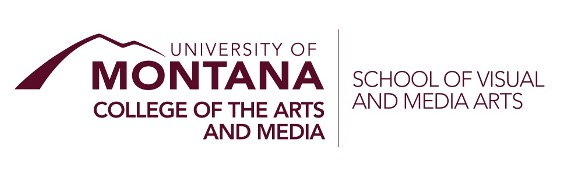

# Principles of Interactive Art _[Media]_ (MART 340)

Date modified: Aug-24-2021

**Table of Contents**

<!-- TOC depthFrom:1 depthTo:2 withLinks:0 updateOnSave:0 orderedList:0 -->

- [Course Overview](#course-overview)
    - [Basic Info](#basic-info)
    - [Professor/Instructor](#professorinstructor)
    - [Description](#description)
    - [Objectives & Student Learning Outcomes](#objectives--student-learning-outcomes)
    - [Course Modality/Format](#course-modalityformat)
    - [Course Websites](#course-websites)
    - [Pre-Requisites](#pre-requisites)
    - [Books, Supplies, & Technology](#books-supplies--technology)
- [Course Policies](#course-policies)
	- [Course Evaluation](#course-evaluation)
	- [Grades](#grades)
	- [Course Workload](#course-workload)
	- [Zoom Related Information](#zoom-related-information)
- [SVMA, CAM, and University Policies and Information](#svma-cam-and-university-policies-and-information)
	- [School of Visual and Media Arts](#school-of-visual-and-media-arts)
	- [Academic Honesty, Plagiarism, and Cheating Policy](#academic-honesty-plagiarism-and-cheating-policy)
	- [Sensitive Subject Matter & Censorship](#sensitive-subject-matter--censorship)
	- [Be Kind](#be-kind)
	- [Diversity Statement](#diversity-statement)
	- [Student Support Resources](#student-support-resources)
	- [COVID-19 Specific Information](#covid-19-specific-information)
	- [Land Acknowledgement](#land-acknowledgement)
	- [Changes to the Course](#changes-to-the-course)

<!-- /TOC -->

# Course Overview

## Basic Info

- Name: Principles of Interactive Art
- Course Number: MART 340.50
- CRN: 72405
- Term: Fall, 2021
- Credits: 3
- Location: Online/Asynchronous (with optional weekly zoom session)
	- Moodle Link: [https://moodle.umt.edu/course/view.php?id=43552](https://moodle.umt.edu/course/view.php?id=43552)
	- Main Content Link: [https://montana-media-arts.github.io/340-interactive-art/](https://montana-media-arts.github.io/340-interactive-art/)
- Date/Time: Optional weekly zoom session -- TBA
- University Unit: [School of Visual and Media Arts (SVMA)](https://www.umt.edu/svma/), [College of the Arts and Media (CAM)](https://www.umt.edu/umarts/), [University of Montana](https://www.umt.edu)

## Professor/Instructor

- [Michael Musick, PhD](http://michaelmusick.com)
- E-Mail: [michael.musick@umontana.edu](mailto:michael.musick@umontana.edu?subject=mart340%20Question).
- Office: McGill Hall, 232
- Office Hours:
  - In-person (McG 232): Monday's noon-1pm
  - Virtual via Appointment from Link: [calendly.com/michael-musick](https://calendly.com/michael-musick)
	- Please select a meeting time from availability via the Calendly web service. This will then provide you with a zoom link

**Teaching Assistant**

- Tina Mahagamage
  - [kristina.mahagamage@umconnect.umt.edu](mailto:kristina.mahagamage@umconnect.umt.edu?subject=340%20Question)
- Charlie Apple
  - [charlie.apple@umontana.edu](mailto:charlie.apple@umontana.edu?subject=340%20Question)

## Description

What is interactivity? What does it mean to create meaningful interactive experiences? In this hands-on course, students learn how to create interactive works and environments. We talk about what it means to create an interactive experience for general participants. Scale, space, and time are explored with reference to the body, while creating cybernetic systems for real-time and time-based interaction. Software, electronics, and physical computing are discussed, with the goal of students' creating physical projects. A variety of input and output mechanisms, networking, and best practices will be covered in lecture. Class discussions will cover readings about interactive art/music, design, space, and installation. Students are free to explore their own ideas through the lens of this course.

This course will include a heavy technical introduction to modern tools, as well as a mix of reading, discussion, interactive development, and projects.

## Objectives & Student Learning Outcomes

Through this course, students are expected to;

- Illustrate an understanding about interactive art and interactive theory
- Become versed in some of the tools and techniques available for the creation of interactive artworks, including;
	- real-time render development environments
    - real-time digital signal processing
    - data capture, including;
        - symbolic controllers (MIDI)
        - audio signals via microphones
        - physical computing (buttons, sensors, or basic electronics)
        - computer vision (edge detection, face recognition)
    - immersive environment construction
- Evaluate experience differences for various types of interactive works;
    - Web-based verse Physical-based works/experiences
    - time-dependent or input-dependent works/experiences
- Distinguish the difference between reactive, interactive, and dynamically changing systems.

Students are expected to bring ideas to explore these techniques. The goals of the projects are not simply about the successful application of the technical processes. Instead, the goal is to integrate these technical elements to make work that is meaningful.

This course will conclude with an intensive project. The goal of this artistic work is to incorporate the interactive theory, art, and concepts discussed during the first half of the course. The latter half of the course will be devoted to designing, composing, and building work. This will give students a real-world experience.

## Course Modality/Format

Due to the ongoing COVID-19 pandemic, the Department of Media Arts has moved all of our classes to online/asynchronous or remote/synchronous for the 2020/21 academic year. As a result, this course will be delivered via an _online/asynchronous_ modality. This means all content is available via the web, for you to approach each week on your own schedule.

Additionally, I will hold an optional Zoom-based lectures. This lecture will not cover new material or material beyond the content available each week via the web. However, it will serve as an opportunity for students to hear about the content from me directly, engage with me, and ask questions.

#### Course Recording

This serves as an explicit declaration that all courses meetings may be recorded. These will then be available for further study at a later time by students of the course.

## Course Websites

This course will be facilitated via multiple web technologies.

- Moodle -- Moodle will serve as a secure location for you to submit homework, receive feedback, and engage in discussion forums with your colleagues.
- Content Website -- Content for this site will primarily exist on an exterior website, hosted via GitHub. This is where you will complete most of your learning.
	- [montana-media-arts.github.io/340-interactive-art/](https://montana-media-arts.github.io/340-interactive-art/)
	- I will leave the course website up and live at the conclusion of this course. In this way, it can serve as a living resource for you in your sonic art practice and work. _Please note: Since I will leave this website live, this also serves as an opportunity for you to 'look ahead' at the content to come. However, content IS NOT considered live or required for this course until the week it is active. In other words, I WILL change weekly content from semester to semester, therefore you cannot guarantee what you look at in the future will actually get taught._

## Pre-Requisites

This course does have a pre-requirement that you have successfully taken _Creative Coding 1 (MART 120)_. For those of you who requested overrides into the course or waving of this requirement, you may need to spend extra time on the technical aspects of this course to stay caught-up.

It is also advised that have completed Creative Coding 2 (MART 220), as well as Web Development and Web Technologies (MART 341/441).

Additionally, you are expected to utilize your previous expertise in coding, content creation, story telling, art, sculpture, sound, music, dance, etc. towards the projects presented in the course.

## Books, Supplies, & Technology

This course does require your purchase or acquisition of some software and technology.

### Software

You will be required to have a development environment installed on your computer for assignments this semester. For this semester, instruction of technology specific skills will be demonstrated and taught in [TouchDesigner](https://derivative.ca).

> **The makers of TouchDesigner describe it as follows;**
>
> TouchDesigner is a visual development platform that equips you with the tools you need to create stunning realtime projects and rich user experiences.  Whether you're creating interactive media systems, architectural projections, live music visuals, or rapid-prototyping your latest ideas, TouchDesigner is the platform that can do it all.

TouchDesigner is a widely used development platform within the creative coding community. As such we will be learning it this semester. In addition to its incredible power and agility, TouchDesigner operates under a financially accessible model, with a free, "non-commercial" license.

<!--
For this semester, instruction of technology specific skills will be demonstrated and taught in [Ableton Live](https://www.ableton.com/en/shop/education/). This is an industry standard for creative applications with audio and sound. This is also a piece of software that will be taught in courses throughout the sonic arts track.

You are encouraged to purchase this software or utilize media art's computer labs, where it is available for student use.
-->

### Books

There are no required texts that you must purchase for this course. All readings, music, or sound examples will be available to you through web links, the library, or the class Moodle.

# Course Policies

## Course Evaluation

Student work and progress will be assessed through;

- Large Projects
	- There will be a number of larger assigned projects throughout the semester that relate to the current topics being discussed. These are the students opportunity to synthesis creative concerns and technical concerns from multiple weeks of content into significant artworks.
- Project Presentation
    - At least one of the projects from this semester are required to be presented publicly. These will likely occur through course organized shows.
- Project Documentation
	- Each large project will require project documentation, including; a demo video, academic report describing aesthetic and technical success in relation to the larger field, and a written description.
- In-class discussions and critiques
    - You are expected to engage with class discussions about technical and artistic issues.
    - You are expected to engage with class discussions about outside readings, videos, and listenings.
    - You are expected to engage in class critique days of large projects.
- Smaller Weekly Exercises
	- During the technical development portion of the course, you will be expected to complete weekly assignments that allow you to develop your technical capabilities.
- Daily Sketching
	- After spending time developing technical skills, you will be asked to engage in a daily sketching practice.

#### Projects

We will have a number of larger projects throughout the course that are relevant to presented concepts, techniques, and creative ideas. These are the students opportunity to synthesis creative concerns and technical concerns from multiple weeks of content into singular artworks.

Project grades will be based primarily on the student’s ability to:

1.  Demonstrate an understanding of the specific characteristics and integrative capabilities of the assigned topic through artistic output, written documentation, and technical achievement.
2.  Articulate a clear and concise perspective within the artwork.
3.  Present an organized artistic piece, as well as; technical report, file/program structure, and demo video.
4.  Demonstrate engagement with an iterative process of ideation → creation → presentation → assessment.
5.  Demonstrate creativity beyond the expected technical requirements.
6.  Properly and punctually deliver all assignment files.

**Please Note:** All Projects are required for this course. Failure to complete and submit a project will result in a failing grade for the course. There are no exceptions to this rule. Completion of this course requires all projects be completed.

#### Participation

This class will be participatory, and you are expected to participate in discussions and give feedback to other students.

## Grades

#### Final Grades

Grades will be determined according to the following breakdown:

- Forum-based participation, discussions, and critiques: 10%
- Creative and Technical Skill Development Projects: 50%
- Screening and Reading Responses: 15%
- Daily Sketching Practice: 10%
- Final Creative Project: 15%

Letters are assigned according to the following final course percentages:

| Grade | % Range 	|
|:-----:|:---------:|
| A  	| `[93-100]`|
| A- 	| `[90-93)`	|
| B+ 	| `[87-90)`	|
| B  	| `[83-87)`	|
| B- 	| `[80-83)`	|
| C+ 	| `[77-80)`	|
| C  	| `[73-77)`	|
| C- 	| `[70-73)`	|
| D  	| `[60-70)`	|
| F  	| `[0-60)`	|

#### Late Work

IMPORTANT: Since projects are experienced and critiqued as a group through the discussion forum critique model, late projects are not permissible and will not be accepted.

Documentation assignments or weekly sketches handed in after the due date and time will have points deducted for lateness. This will be in addition to any points deducted for content. Those that are uploaded late but within one day of the due date will lose 5% for lateness.  For those uploaded after that, the number of deducted points will be at the discretion of the professor, who reserves the right to no longer accept it.

#### COVID-19 Consideration

If you contract COVID-19 during the course of this semester, I will work with you to as is at all possible, to help you stay caught-up or to catch-up.

<!--
## Attendance

- Attendance will be taken at the beginning of every class
- Critique days are mandatory. No exceptions. No tardiness.
- Contact me in advance if you will not be in class. (email is preferred)
- Unexcused absences will affect your grade.
    - One absence is allowed; after that, your final overall grade for the course will drop by 2.5% for each additional absence.
- You are expected to work with colleagues to catch-up on what you missed.
--> 

## Course Workload

This course takes time. Some things might be easier than others.

This course will be broken up into "weekly content modules". Each week, a new module will be released on the same day of the week, you will then have one week from that date to complete that week's module.

Some week's will be more intense than others. But generally, you should plan to spend 3-9 hours a week on course work (including: working through the content and lectures; completing readings, listenings, and videos; and completing weekly skills-based assignments assignments).

In addition, there will be a final presentation of materials. This final presentation will include additional time for viewing and feedback.

## Zoom Related Information

Classes may be offered via Zoom, at the discretion of the instructor, or as a result of University policies.

<!--
#### Zoom Attendance

When class sessions occur via zoom, you are still expected to be present in class. Even though most classes will be recorded and these recordings can be used to experience the conversation that occurred, these do not substitute for an in-class experience. As such, absences from zoom-based class sessions will be considered unexcused absences from the course.
-->

#### Zoom Etiquette

When attending class via Zoom, you are expected to act similarly to how you would if attending in-person. This means:

- Students should plan on having their cameras on so that everyone in the class may engage with them via discussion. (The Instructor will inform students when it is appropriate or necessary for cameras to be off.)
- Students should ensure that they attend Zoom-based courses somewhere with a sufficiently fast and large-enough-bandwidth internet connection so as to facilitate multi-directional video conferencing.
- Students should ensure that they are presentable visually.
- Students should ensure that their camera background is professional and free from unnecessary visual/audio distractions.
- Students should position themselves so that they do not need to constantly move around their space with their camera.
- Students should ensure sufficient lighting for their faces, so that everyone can engage with them.
- Students should ensure that the quality of their audio (both microphone and speakers) are sufficient to facilitate high-quality conversation.

# SVMA, CAM, and University Policies and Information

## School of Visual and Media Arts

Information about the School of Visual and Media Arts (SVMA) is available at:

- [https://svma.umt.edu](https://svma.umt.edu)

Please join SVMA social media to stay informed about events and happenings in our school.

- Instagram:  [https://www.instagram.com/umt_svma/](https://www.instagram.com/umt_svma/)
- Facebook: [https://www.facebook.com/UMTsvma](https://www.facebook.com/UMTsvma)

**Student Art Collective**  (this is primarily for art students) The collective is a student –organized and student-led group that sponsors art related workshops, events, and the Annual Juried Student Art Show.  Look for informational posters. The Director recommends soliciting student participation in art classes.

## Academic Honesty, Plagiarism, and Cheating Policy

Students are expected to adhere to academic conduct policies of the University of Montana as explained in Section V of your [University of Montana Student Conduct Code](https://www.umt.edu/student-affairs/community-standards/default.php):  “Academic misconduct is subject to an academic penalty by the course instructor and/or a disciplinary sanction by the University.  Academic misconduct is defined as all forms of academic dishonesty, including but not limited to:  (1) plagiarism, (2) misconduct during an examination or academic exercise, (3) unauthorized possession of examination or other course materials, (4) tampering with course materials, (5) submitting false information, (6) submitting work previously presented in another course, (7) improperly influencing conduct, (8) substituting, or arranging substitution, for another student during an examination or other academic exercise, (9) facilitating academic dishonesty, and (10) Altering transcripts, grades, examinations, or other academically related documents.”

Dishonesty will not be tolerated in this course. This includes, but is not limited to, cheating on tests, cheating on assignments, fabricating information or citations, having unauthorized possession of examinations, submitting work of another person or work previously used, or tampering with the academic work of other students. Academic misconduct is defined within the Student Conduct Code handbook.

Students who cheat or plagiarize will receive academic sanctions, which may include an “F” grade on the assignment, examination, and/or in the course. Students will also be reported to the Dean of Students for possible further disciplinary action.

#### Using Code or Media Found Elsewhere

It is easy to find code and media (i.e. videos, sounds, images, etc.) online. If you use code or media from elsewhere (which you will at times), I expect you to cite the work and author.

If you use found code, you are expected to comment each line, as to what each line does programmatically. _Do not_ summarize several lines of code from a high level (i.e., TV Guide). I expect you to comment each line on a granular level. In addition, in these cases, I am also looking for significant modification of the code, for you to enact your own ideas and to experiment heavily. Significant modification means beyond variable name and value changes. It is bending these concepts to your idea, especially graphically. It is not a copy and paste job. Also, never more than 40% of your code may be supplied from elsewhere. Period. If you use code from online, whether for inspiration, modification or reference, I expect to see a link in your comments from where you got the code and who wrote it. Otherwise it will be considered as plagiarism, and you will fail the assignment. The code must have a reference, along with URL and be commented out LINE BY LINE.

If you use found media, *YOU* are responsible to ensure it is used according to fair-use guidelines. The pieces you make in this course are intended to be portfolio-quality works. Therefore, you should not utilize found media with restrictive use guidelines or licenses. You can read more about various licenses at;

- [opensource.guide](https://opensource.guide/legal/)
- [choosealicense](https://choosealicense.com)
- [GNU Licenses](https://www.gnu.org/licenses/licenses.en.html)
- [Creative Commons Licenses](https://creativecommons.org/share-your-work/licensing-types-examples/)
- [opensource.org](https://opensource.org/licenses)

For found media, you are also expected to cite the media in your documentation for the project.

## Sensitive Subject Matter & Censorship

This course operates under a no censorship policy, and you should feel free to experiment with challenging topics in your projects. That said - if you submit work with violent or sexually explicit themes, containing hate speech, racial slurs or other sensitive subject matter, I might contact you to request more background information on your choices.

Art scholarship and art practice along with teaching and learning involve a critical exploration of ideas, theories, art-making practices, and art movements that encompass such things as the human body, sexuality, race, gender, religions, and cultures. This course can touch upon any of the above categories with an expectation that students will actively participate in all course assignments, discussions, and tests. Given this information, it is the student’s obligation to determine that the requirements conflict with his or her core beliefs. If the student determines that there is a conflict with his or her beliefs, one of the following actions needs to be taken: 1) drop the class before the last day to drop a course without penalty; 2) meet with the instructor within the first week of classes to determine if an accommodation can be made.  (Note, faculty, are not required to grant content accommodations.)

## Be Kind

Be respectful to each other, help each other, and be considerate in your communications with the instructional team.  No trolling shared work and ideas. Be constructive with any critical feedback you give.

## Diversity Statement

Your experience in this class is important to me.  I welcome individuals of all backgrounds, beliefs, ethnicities, genders, gender identities, gender expressions, races, national origins, religious affiliations, sexual orientations, ages, abilities, and other visible and nonvisible differences. Please know that I will gladly honor your request to address you by an alternate name or gender pronoun.  All members of this class are expected to contribute to a welcoming, respectful, and inclusive environment for every other member of this class.

## Student Support Resources

### Disability and Equity Accommodations

The University of Montana assures equal access to instruction through collaboration between students with disabilities, instructors, and the Office for Disability Equity (ODE). If you anticipate or experience barriers based on disability, please contact the ODE at: (406) 243-2243, [ode@umontana.edu](mailto:ode@umontana.edu), or visit [www.umt.edu/disability](www.umt.edu/disability) for more information. Retroactive accommodation requests will not be honored, so please, do not delay. As your instructor, I will work with you and the ODE to implement an effective accommodation, and you are welcome to contact me privately if you wish.

### The Writing and Public Speaking Center

The Writing and Public Speaking Center provides one-on-one tutoring to students at all levels and at any time in the writing process. Visit now. Visit often. They're ready when you are. [www.umt.edu/writingcenter](www.umt.edu/writingcenter).

### Mental Health and Wellbeing Policy

The University of Montana is committed to advancing the mental health and wellbeing of its students. If you or someone you know is feeling overwhelmed, depressed, and/or in need of support, services are available. For help, visit https://www.umt.edu/diversity/resources/mental-health.php

## COVID-19 Specific Information

- Mask use is required within the classroom or laboratory.
  - NOTE: All CAM buildings are considered active classrooms and laboratories, due to the nature of work we conduct in the arts. Therefore masks are required within all CAM buildings (including the entirety of McGill)
- If you feel sick and/or are exhibiting COVID-19 symptoms, please don’t come to class and contact the Curry Health Center at (406) 243-4330.
- If you are required to isolate or quarantine, you will receive support in the class to ensure continued academic progress.
  - As this is an asynchronous class, all material will remain available to you.
  - Please reach out if you need further accommodations due to a COVID-19 case.
- UM recommends students get the COVID-19 vaccine. Please direct your questions or concerns about vaccines to Curry Health Center.
- Where social distancing (maintaining consistent 6 feet between individuals) is not possible, specific seating arrangements will be used to support contact tracing efforts.
- Class attendance and seating will be recorded to support contact tracing efforts.
- Drinking liquids and eating food is discouraged within the classroom.
- Please note this class is being recorded. Notifying students is a requirement if this is the case.

- Up-to-Date COVID-19 Information from the University of Montana
	- UM Coronavirus Website:  [https://www.umt.edu/coronavirus](https://www.umt.edu/coronavirus)
	- UM COVID-19 Operations Plan:  [https://www.umt.edu/coronavirus/campus-covid-plan/default.php](https://www.umt.edu/coronavirus/campus-covid-plan/default.php)

As a final reminder, we (The University Community) strongly encourage you to remain vigilant outside the classroom in mitigating the spread of COVID-19. The only way for this semester to be successful and to maintain minimal interruptions to our educational mission is to ensure the safety and health of all members of our community. Please remember that, and make all decisions and choices during this time with this idea above all others; that the safety and health of our entire community is our most important goal.

#### In Case the Instructor Becomes Sick

If I become sick from COVID-19 during the course of this semester, I will do everything I can to maintain my teaching and mentorship, utilizing the existing modalities established for this semester. However, I will obviously be unable to utilize my university office and will therefore have to make adjustments.

If I become unable to attend weekly class sessions, I will alter the course such that you may continue with your individual projects in an appropriate manner. I will also likely ask that you continue to meet as a cohort, so that you can support each other in your research and artistic pursuits.

## Land Acknowledgement

he Séliš-Ql̓ispé Cultural Committee created the language, _"The University of Montana acknowledges that we are in the aboriginal territories of the Salish and Kalispel people Today, we honor the path they have always shown us in caring for this place for the generations to come."_

## Changes to the Course

I reserve the right to change the intended content of this course throughout the semester. This may be done to adjust for the speed of the class, to better meet educational goals, or to account for changes in technology.
