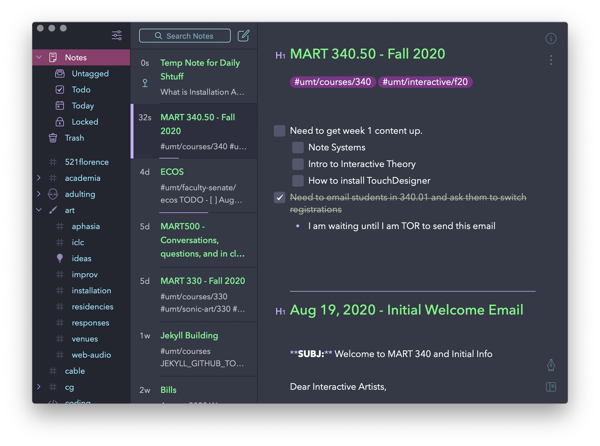

For this course, you are required to use a digital-based system and environment for taking notes yet.

If this is new to you, I believe it is important that you attempt to take notes with your computer. You may ultimately decide that this method does not work for you and switch back to a hardcopy method (i.e. hand-written in a notebook, journal, etc.). But, for this semester, I want to explore using a digital-based system and see how that alters your ability to engage with information, track your own ideas, and store inspirational content that you come across.

> **{ _note_ }:**
>
> There are plenty of studies that suggest it is better for students to take notes with a pen or pencil, I however believe that it is important for you to learn to utilize the computer (including your phone, tablets, etc.) as an extension of your memory and cognitive ecosystem.

By using a digital-based system, you can easily switch back and forth between content, research, note taking, etc. Using a digital-based system should make it easy for you to create links to or copy web-based content/information you happen across, to make notes of information in your classes, and to take notes while spending all the time on Zoom that you will this semester.

Another strong reason that I encourage a digital-based system is that you are undoubtedly already accustomed to using your phone and computer as an extension of your general knowledge. This happens whenever you do not know something off-hand, but instead know that you can quickly search for the relevant information on the web. Note taking (although not its only purpose) can serve to fill out this capability. Taking notes allows you to store information, that can later then be accessible to you for use. If this occurs in a system that you have access to most of the time (such as a digital system with a connection to your phone) than you can guarantee that information will be available to you when you may need it.

## Abilities and Features to Look For

The most important factor in a note taking system for myself is one that I can easily access on any device I have near by, and that makes taking notes easy. I would highly encourage you to identify and try a system that allows you to sync notes between all of your connected devices (computer, phone, tablet, and potentially web).

You could of course use Microsoft Word or a basic text editing application on your computer, and then store the associated files in a cloud-based storage system, such as Box, OneDrive, Google Drive, or Dropbox. However, the drawback of this solution is the amount of time it takes to find, potentially download/sync, and open the appropriate file to access previously stored information of add additional information. Therefore, I STRONGLY discourage the use of this type of system.

Instead, I highly encourage you to use a system specifically designed for taking notes. This system should;

- Be easily opened, so that you can;
  - quickly view previously stored information
  - or quickly add new information (without having to pause for load times, etc)
- Be easily accessible on any device you own / have access to you
- Include an organization system that allows you to see notes relating to the same topics, themes, or situations (i.e. all notes for this class, or all notes relating to computer vision)
- Include an ability to easily search your entire database of notes so that you can quickly find information (THIS IS A CRITICAL REASON FOR USING DIGITAL-BASED SYSTEMS)
- Allow you to easily reference content that you may come across
  - This type of content may include;
    - Websites
    - YouTube Videos
    - Taking pictures/videos of specific things with your phone

## Suggested Environments/Tools/Technologies

There are many great systems for you to consider. And the best system for you is going to depend on a number of qualities specific to you.

### Bear

I personally use a system called [Bear](https://bear.app). This is a markdown-based editor that organizes notes by "tags" and "topics". It is a lightweight app that also syncs in near-realtime between all of my connected devices.

The potential and major problem for Bear is that it is an Apple/Mac only system. It does not have native apps for Windows or Linux based systems.

Bear does cost money for syncing ($1.49/month), but is free if you are willing to only have it on a single device.

### Evernote

[Evernote](https://evernote.com) has been a premium note taking environment used widely for many years now. If you are looking for something that is not markdown-based, then [Evernote](https://evernote.com) might be for you.

Evernote is quite a bit more expensive than Bear, but it does have features more in line with something like Microsoft Word.

### OneNote

As a University where you all have Office 365, another great option to consider is Microsoft's [OneNote](https://www.microsoft.com/en-us/microsoft-365/onenote/digital-note-taking-app?ms.url=onenotecom&rtc=1). As with Microsoft Word, Office 365 allows you to use [OneNote](https://www.microsoft.com/en-us/microsoft-365/onenote/digital-note-taking-app?ms.url=onenotecom&rtc=1) as part of the fees that you pay every year to the University.

Since its free, and it meets the requirements all laid out above, this is one tool you should seriously consider.

### Other Readings

If you would like more information in picking a note-taking environment, these articles may prove useful.

- [The 11 Best Note-Taking Apps in 2020 – Evernote, Notion, and More](https://collegeinfogeek.com/best-note-taking-apps/)
- [Best note-taking apps of 2020 - TechRadar](https://www.techradar.com/best/best-note-taking-app)
- [The 10 Best Apps for Note-Taking in 2020](https://www.lifewire.com/best-apps-for-note-taking-4172070)
- [The 9 best note taking apps of 2020 - Zapier](https://zapier.com/blog/best-note-taking-apps/)

## **_{ TODO: }_**

Please pick and setup a note taking app.

Part of your assignment this week will be to take a screenshot of your system.
