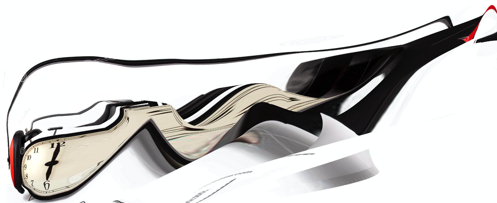

For this week, you should start to consider what the terms _interactive_, _interaction_, and _interactivity_ mean. Towards that end, this page will serve to lightly introduce you to these terms, questions you might ask as you search for answers, and basic ideas to keep in mind.

 

**_{ TODO: }_**

Please consider:

- What does it mean to you for something or an experience to be "interactive"?

Spend a few moments considering what this means to you at this moment in your education. Once you start to come up with some working definitions for this term, please write them down in a new note (using your previously setup note system) that you can return to later this week, as well as later in the semester.

 

# The Art _is the Interaction_, NOT the Final Product

A major shift that you will need to accept in interactive art is that the "art" _is the interaction_. As many point out, this is part of an ongoing path in artistic practice where the final _artifact or object_ is no longer the central concern of artistic works, but instead the central concern is with a _participant's "experience"_.

## The Traditional Role of the Object

Some conservative views of art hold that the resulting product or artifact is the object of art. This artifact may be discussed in terms of its form, technical achievement, "beauty", what it represents, simplicity, use of color, or many others ideals of art championed by various artistic periods over the course of history. The general idea is, even in process oriented art, that the final product represents the object of inquiry and that the presentation of this object in a gallery is how to share this art.

## Art as Event

For this semester, we are going to primarily limit our discussion of interactive art to those works where the experience of the participant is what defines the work of art. Under this idea, the work of art is only a theoretical idea until a participant has engaged with a work and had an experience with that work resulting in an artwork-event. It is through this experience that the participant is able to understand the work.

In interactive art, the engagement of a participant is typically required for the artwork to function. The engagement of the participant will allow the artwork to receive data or energy, thereby giving the work of art the ability to function.

This engagement between some _thing_ and the _participant_ results in the occurrence of an _event_. This event encapsulates the experience of the participant, which is the object of art.

> "An interactive work of art ... inevitably takes on the shape of an event. An artist does not make a final, completed piece of art, instead produces an area of activity for the receivers, whose interactive actions bring to life an artwork-event. Regardless of what shape the final product of an artist’s activity takes on, an interactive piece of art finds its real, final formation only as a result of participative behavior of the audience. The latter ones in that way become participants, performers, executors, or (co)creators of an artwork-event."
>
> - Ryszard W. Kluszczynski

 

As a first example of this change in approach, I want you to watch this video about Daniel Rozin's work with mechanical mirrors. This artist (and [professor](https://tisch.nyu.edu/about/directory/itp/95804818) at [NYU's ITP Program](https://tisch.nyu.edu/itp)) is interested in challenging participant's perceptions of how they see themselves in images.

<iframe class="embed-responsive-item" src="https://www.youtube.com/embed/kV8v2GKC8WA" frameborder="0" allow="accelerometer; autoplay; encrypted-media; gyroscope; picture-in-picture" allowfullscreen></iframe>

As you can see in the above video, these mirrors are interesting, but ultimately meaningless without a participant to engage with. The pieces require the engagement of someone/something in order to change. Only through this active engagement is a participant then challenged to consider the perception of how they may be viewed by others (person or machine).

# Interactive Art and Time

Another obvious, but important quality of interactive art is its relationship to _"time"_. Since interactive art is reliant on participant engagement in order to experience the artistic focus, resulting in artwork-events, it follows that interactive art is therefore reliant on the passage of time. There is no way of having an experience with interactive art without the passage of time occurring.

Interactive art is a time-based art. As we create, discuss, explore, and contemplate art relating to this class this semester, we will need to do so in relation to time. Likewise, it will be important for you to spend time this semester considering how time effects interactive art.

# Further Reading

**_{ TODO: }_**

As we get going this week, I want you to read the following article;

- Edmonds, Ernest. “The Art of Interaction.” Digital Creativity, vol. 21, no. 4, 2010, pp. 257–64, doi:10.1080/14626268.2010.556347.
  - [Available on Moodle for download](https://moodle.umt.edu/pluginfile.php/2707692/mod_resource/content/0/The%20art%20of%20interaction.pdf)
  - If logged into the library, it is directly available from Taylor and Francis Online at: [https://www.tandfonline.com/doi/abs/10.1080/14626268.2010.556347](https://www.tandfonline.com/doi/abs/10.1080/14626268.2010.556347)

When reading the above article, please pay particular attention to the discussions of the role of "interaction" as well as how the focus of the art changes to participant engagement.

<h4>References and Resources</h4>

The above content was adapted from:

<ol>
<li><a href="https://doi.org/10.3402/jac.v2i0.5525">Kluszczynski, RyszardW. “Strategies of Interactive Art.” Journal of Aesthetics & Culture, vol. 2, no. 1, 2010, p. 5525, doi:10.3402/jac.v2i0.5525.</a></li>
</ol>

