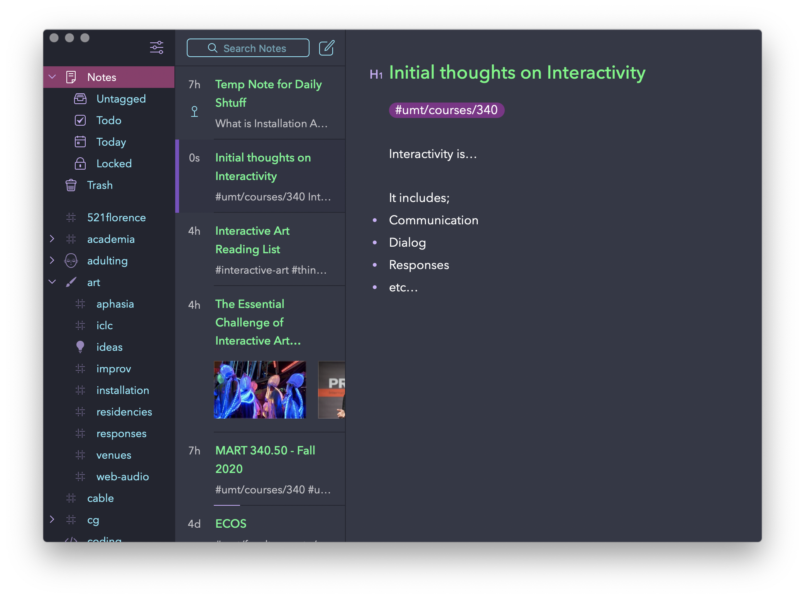

For this first week, you should do and submit the following as either a single .zip package, or as individual document uploaded to the relevant homework assignment.

## 1. Screenshot of your note program

To start this week, please take a screenshot of your note system. When you take this screen shot, I would like you to have a note pulled up of your "initial thoughts of interactivity".

## 2. Response to Edmonds, “The Art of Interaction.”

After reading the article from the [_Intro to Interactivity_ page]({{site.baseurl}}/modules/week-1/interactive-intro/#further-reading), please write a response that begins to define a more concrete idea of what "interactivity" is to you.

You should write this into a "note", in your notes system. Then export this note as either a text document, or pdf document. You will submit this exported document.

## 3. General Help and Assistance Forum

Post a question about Interactivity in the course ["General Help and Assistance Forum" hosted on Moodle](https://moodle.umt.edu/mod/hsuforum/view.php?id=2299977).
Then respond by answering a classmates question on the focum. 

Remember the General Help and Assistance Forum is there to help your navigate TouchDesigner and the various modalities of interactivity. Everyone is welcome to post questions and solutions throughout course. 

## Submission

When you are finished, please submit these two files to the [Week 1 Assignment Submission](https://moodle.umt.edu/mod/assign/view.php?id=2299982&forceview=1).
