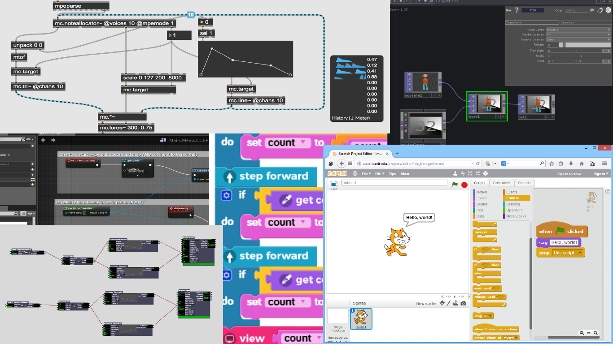

 

<iframe class="embed-responsive-item" src="https://www.youtube.com/embed/eoW5fqy5_18" frameborder="0" allow="accelerometer; autoplay; encrypted-media; gyroscope; picture-in-picture" allowfullscreen></iframe>

# What is TouchDesigner

TouchDesigner (**TD**)is a node-based, visual programming environment, for real-time, interactive multimedia content. TD is part of the larger _Creative Coding_ world and is used by artists, programmers, and performers to create interactive artworks, performances, installations, sculptures, AR/VR experiences, as well as fixed-media works.

We are going to use TouchDesigner this semester in order to insure that all students are utilizing the same technology, and to provide a common language/environment for the technical discussion of interactive concepts.

TouchDesigner is a complex program, which allows for incredible flexibility in the types of work that can be created with it. Working in an environment like TouchDesigner can be freeing, as you are not limited in the type of work you can create as you are with something like the Adobe ecosystem. _Obviously, Adobe makes an incredible suite of applications that perform their tasks admirably, and they are standard within the industry for the quality of their software._ However, when working in something like After Effects, you are limited in the types of workflow you can create, media you can export, and media you can import. Whereas, with TouchDesigner, you can bring in almost any kind of media that can be digitized, as well as sensor data and real-time data streams from the web, while also maintaining flexibility in creating fixed works, or larger-than-life responsive and real-time works that can exist in the most massive of real-world spaces.

## Visual Programming

A visual programming environment or language, such as TouchDesigner, is one that relies on visually arranging and connecting elements together to create programs (see the above image). This is opposed to more text-based languages or environments, where a developer would use a text editor (like P5.js, Processing, SuperCollider, C/C++, etc.). A visual programming environment can be more intuitive for some individuals, especially those who are more visually oriented, such as artists and designers. These types of languages have opened the door to coding and development for many artists.

Some examples of other visual programming environments include;

- Cycling 74's Max
- Isadora
- Unreal
- Scratch (_which you likely started with in Creative Coding 1_)

# What Can TouchDesigner Do?

As mentioned above, TouchDesigner is a complex environment, that is capable of being used for a wide-variety of media-focused work. Initially, TD was created with the goal of serving as a visual performance tool to accompany music. (You can read about the history and evolution of TD in the [20 Year Retrospective of Derivative](https://derivative.ca/community-post/derivative-20-year-retrospective-part-1))

TD now is used for applications such as animation, projection mapping, music visuals, light control, laser control, media server management, and production television. Just to name a few applications.

The [NODE Institute has a great overview of people working with TouchDesigner that is presented below.](https://thenodeinstitute.org/courses/introduction-to-visual-programming-with-touchdesigner/lessons/what-is-touchdesigner-and-why-should-i-use-it/topic/how-do-artists-and-designers-use-touchdesigner/)

> Many artists and developers use TouchDesigner to combine audio, video, data, and technologies. Let’s look at a few examples:
>
> ## Deep Web
>
> 
<iframe class="embed-responsive-item" src="https://player.vimeo.com/video/181520274?color=ffffff&title=0&byline=0&portrait=0" frameborder="0" allow="accelerometer; autoplay; encrypted-media; gyroscope; picture-in-picture" allowfullscreen></iframe>

> 
<a href="https://vimeo.com/181520274">DEEP WEB - coming back to KRAFTWERK BERLIN in summer 2019</a> from <a href="https://vimeo.com/whitevoid">WHITEvoid</a> on <a href="https://vimeo.com">Vimeo</a>.

>
> [https://www.whitevoid.com](https://www.whitevoid.com/)
>
> This performance/installation by Berlin based company White Void, spearheaded by light artist Christopher Bauder is a perfect example for a show that would be almost impossible without a tool like TouchDesigner. White Void uses very precise DMX controlled winches.They can drive the LED Balls to positions in space. The Lasers on the other hand have no idea, where the balls are. All they understand is an angle in which the shoot the beam. With TouchDesigner the creators could build a software, that allows them to create and perform content in realtime on this synchronised system. Further more, the show itself was controlled from Ableton Live, a music sequencing software. All of this together forms a huge, spacial-audiovisual instrument that can be performed live. Experiences like this have created a new audience and explore new formats as hybrids of art, entertainment and architecture.
>
>
> ## NOMAD live (extract)
>
> 
<iframe class="embed-responsive-item" src="https://player.vimeo.com/video/342449199" frameborder="0" allow="accelerometer; autoplay; encrypted-media; gyroscope; picture-in-picture" allowfullscreen></iframe>

> 
<a href="https://vimeo.com/342449199">NOMAD live (extract)</a> from <a href="https://vimeo.com/wearetundra">TUNDRA</a> on <a href="https://vimeo.com">Vimeo</a>.

>
> [http://tundracollective.com](http://tundracollective.com/)
>
> In this project, the tundra collective uses TouchDesigner to calibrate and synchronise laser projections with generative video animations mapped onto the same screen. Again, this is not a pre-recorded show but a live instrument that can be performed in realtime together with live music.
>
> ## LINIE - Celebrating 100 years of Bauhaus
>
> 
<iframe class="embed-responsive-item" src="https://player.vimeo.com/video/335441463" frameborder="0" allow="accelerometer; autoplay; encrypted-media; gyroscope; picture-in-picture" allowfullscreen></iframe>

> 
<a href="https://vimeo.com/335441463">LINIE - Celebrating 100 years of Bauhaus</a> from <a href="https://vimeo.com/mxzehn">MXZEHN</a> on <a href="https://vimeo.com">Vimeo</a>.

>
> [http://www.mxzehn.de](http://www.mxzehn.de/)
>
> Here we see two works playing with the same space. One is a laser performance by Daniel Dalfovo, the other one is a kinetic LED Installation. Both installations use Touchdesigner to control everything. Due to a very short time frame for development, both were working on open networks to build the show while it was already running.
> Learn more about the setup here:  [https://mxav.net/linie-100-years-of-bauhaus](https://mxav.net/linie-100-years-of-bauhaus)
>
> ## Créatures at SAT
>
> 
<iframe class="embed-responsive-item" src="https://player.vimeo.com/video/276110952" frameborder="0" allow="accelerometer; autoplay; encrypted-media; gyroscope; picture-in-picture" allowfullscreen></iframe>

> 
<a href="https://vimeo.com/276110952">Cr&eacute;atures at SAT</a> from <a href="https://vimeo.com/vincenthouze">Vincent Houze</a> on <a href="https://vimeo.com">Vimeo</a>.

>
> [https://vincenthouze.com](https://vincenthouze.com/)
>
> [Vincent Houze](https://vincenthouze.com/)  is a GLSL shader guru in the TouchDesigner world. Here he performs a fulldome show together with [ Dave and Gabe](https://www.daveandgabe.care/)  who specialise in spacial audio and immersive experiences. Again the system is built with lot of custom software in TouchDesigner and Ableton live. A lot of what Vincent does relies on GLSL shaders – which can be used and authored in TouchDesigner. GLSL is code that is being executed directly on the GPU and that allows for otherwise unachievable performance.  [It is a way to extremely extend the capabilities of TD.](https://thenodeinstitute.org/courses/vanta-glsl-shader-in-touchdesigner/)

# Greg Hermanovic & The Path to TouchDesigner

Now that you have a better idea of what TD can be used for, please watch the creator of TouchDesigner, Greg Hermanovic, discuss his path towards the creation of the software.

<iframe class="embed-responsive-item" src="https://www.youtube.com/embed/J-clJsi3tp8" frameborder="0" allow="accelerometer; autoplay; encrypted-media; gyroscope; picture-in-picture" allowfullscreen></iframe>

# **_{ TODO: }_**

Go to the [TouchDesigner showcase site](https://derivative.ca/showcase) and poke around at the great work being created by the TD community.

- [derivative.ca/showcase](https://derivative.ca/showcase)
- Please spend 20-30 minutes perusing the projects, interviews, and artwork presented in various blog posts here.
- Be inspired!
  - Work to find artists doing things that you find interesting, or may be something that you would want to do.
  - Contemplate how TouchDesigner might be used in your own creative practice.

<h4>References and Resources</h4>

The above content was adapted from:

<ol>
<li><a href="https://thenodeinstitute.org/courses/introduction-to-visual-programming-with-touchdesigner/">Start : Visual Programming with TouchDesigner I, updated July 29 2020. Available from; https://thenodeinstitute.org/courses/introduction-to-visual-programming-with-touchdesigner/.</a></li>
</ol>

