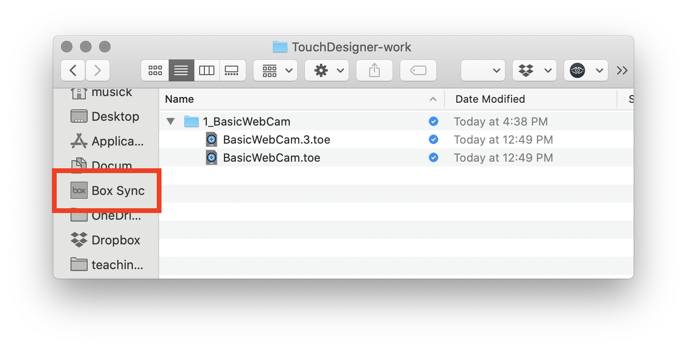
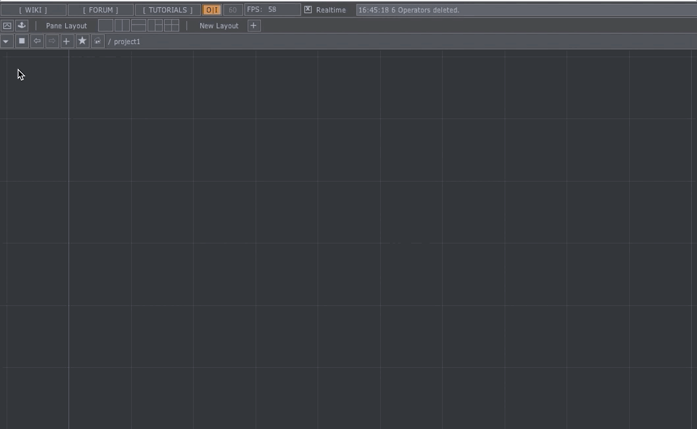
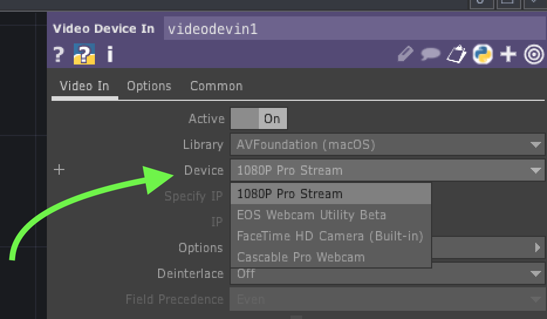
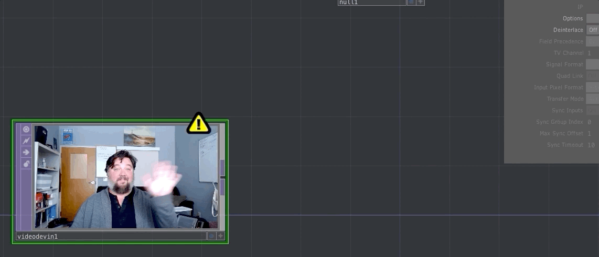
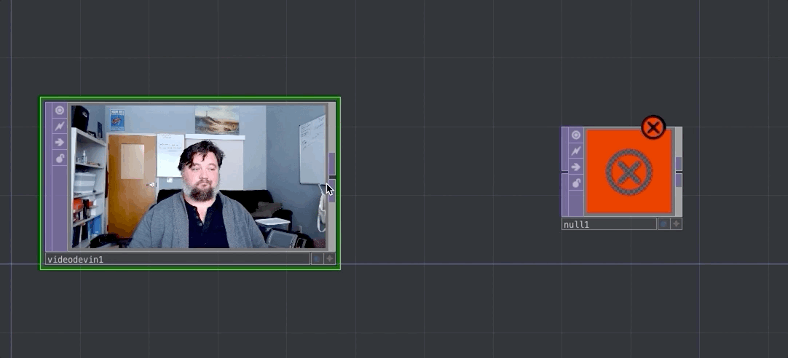
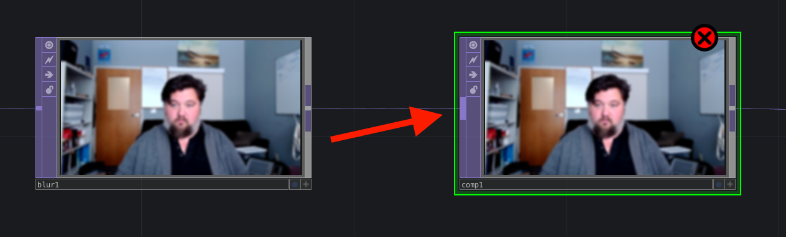

This week is hopefully short and easy for you all. I want you to make a basic webcam filter in TouchDesigner. The following video will walk you through;

1. Setting Up a Project
2. The `null` operator
3. The `videoDeviceIn` operator
4. Viewing your work behind the network
5. Adding TOP's to alter the signal
6. Viewing your work as a separate panel
7. Saving videos of your work

<iframe class="embed-responsive-item" src="https://www.youtube.com/embed/FvSI7zsU-Qg" frameborder="0" allow="accelerometer; autoplay; encrypted-media; gyroscope; picture-in-picture" allowfullscreen></iframe>

## 1. Setting Up a Project

To get started this week, open up a "new project" in TouchDesigner. You can do this by opening TouchDesigner and either selecting all of the nodes in the default project and deleting them, or selecting "New" under the main _File_ menu.

### Save Your Project

First things, first... **Save your project!**

Either select "Save" from the _File_ menu, or press the appropriate key-combo for your OS (likely either Cmd+S or Cntrl+S).

I would suggest you create a new directory in a cloud-based storage solution for all of your TouchDesigner work (such as Box or Microsoft OneDrive, each of which you get 1TB of storage for as a student). You could either name this directory `340-work` or something like `touchdesigner-work`.

Within this directory, create another directory, specifically for this project. I would suggest something like `1-myFirstTouchWebCam`.

Save your TouchDesigner project inside this directory, likely calling it the same name as the directory.

The following image shows this hierarchy and naming pattern.

## 2. Your First Operator

Now that you are saved up, and ready to create, the first operator we are going to do add is a `null`.

To do this, either double click in the workspace, or hit the 'tab' kay. This will bring up the "OP Create Dialog". There you can either start to type `null` to help you find it, or just click the `null` operator. You will then see an empty box, which can be placed in your network, by choosing a location with your mouse and 'clicking'.

The [`null` TOP operator](https://docs.derivative.ca/index.php?title=Null_TOP) "has no effect on the image". This operator, is one you will use extensively, and it allows you to pass or represent instances of networks. Essentially, this is a saving point or bookmark, where you can effect things upstream (to the left of it) without having to reattach or reference the network downstream (to the right of it).

## 3. `Video Device In`

Next, open the OP Create Dialog pane again and this time create a `Video Device In` operator. You should place this operator to the left of the `null`.

After adding this operator, you should open the operators' parameter window and insure that the correct "Device" (in this case, webcam) for your computer is selected.

If you have selected the appropriate webcam, then you should immediately see a preview for the webcam within the `video Device In` operator. You will also likely see a "yellow warning triangle" ontop of the operator.

The warning states: _"Warning: Resolution limited to max 1280x1280 with Non-Commercial key."_ Since we are using the non-commercial version of TouchDesigner, the limit on processing and output of operators is 1280x1280 pixels. So, we need to change the size of the `Video Device In` operator. To do this;

1. open the operators "parameter window" by clicking on it. You will notice at the top of the window that there are 3 tabs; "Video In", "Options", and "Common". _All operators have a "Common" tab_.
2. Select the "Common" tab to change the resolution of any operator. Once you are on the "Common" tab, you will notice that there is an "Output Resolution" parameter. Typically, we will leave this set to "Use Input", which tells the operator to grab the resolution parameters of any upstream (to the left) connect operators. But since this `Video Device In` operator is the furthest upstream operator, we need to alter this manually.
3. Change the "Output Resolution" parameter, to "Limit Resolution".
4. Then in the next dropdown box, select the right arrow, and then the "1280 x 720" option. This will cause the yellow warning triangle to go away.

### Connect the Two Operators

Now that we fixed the warning, you need to connect the two operators. To do this, click the right outlet of the `videodevin1` operator. This will cause a "connection wire" to come from the operator and follow your mouse, when you get close enough to the left inlet of the `null1` operator the connection wire will snap to the operator. You can then click again with your mouse to finalize the connection.

You should now also see the webcam data in the `null1` operator! You have just made your first network!

## 4. Viewing Your Work Behind the Operator

Before we move on to creating the webcam filter, let's first make it so you can view your work in the background of the network.

Most TOP operators have a selectable "display" option. Turning this option on will cause the contents of that TOP operator to be displayed in the TouchDesigner network workspace, behind the nodes of the network. This can be useful to work this way, allowing you to see your progress and changes.

To turn on this capability, press the small blue circle, to the left of the 'plus' sign, in the lower-right corner of the `null1` operator.

You can of course turn off the network display of `null1` by pressing the blue circle again. Likewise, you can turn off the network display of that operator if you find yourself needing to preview the contents of any other operator in your network.

## 5. Add Other Operators!

Time to have fun! Let's add a few more TOP operators to effect the processing of the webcam data in this network.

Right click the connect wire between the `videodevin1` operator and the `null1` operator. This should pull up a menu, where you can select the "Insert Operator" option.

You should then select the `Blur` operator.

### Blur

As you might expect, the [`Blur`]() operator _blurs_ the image. Please open the "parameters window" and explore how the parameters effect the resulting webcam data.

**{ NOTE: }** _Notice how the background of the network shows you the changes you are applying in real-time.

#### Try Edge Instead

Now, let's replace the `blur1` operator in the network with an `edge` operator.

> The TD Wiki states that "The [`Edge`](https://docs.derivative.ca/index.php?title=Edge_TOP) operator finds edges in an image and highlights them. For each pixel, it looks at the values at neighboring pixels, and where differences are greater than a threshold, the output's value is higher."

To replace the operator;

1. open the "OP Create Dialog" window, select the `Edge` operator, then place it below the `blur1` operator
2. Connect the outlet of the `videodevin1` operator to the inlet of the `edge1` operator
3. Then connect the outlet of the `edge1` operator to the inlet of the `null1` operator.

You should see the preview video change to now show edges of your camera data. Again, please feel free to play with the `edge` operator parameters to get a sense of the possibilities of the `Edge` operator.

#### Add a Composite

This is awesome, but obviously, you may find yourself wanting to mix or composite together multiple TOP operators or effects. To do this, we will need an operator capable of compositing data.

Next, let's add a [`Composite`](https://docs.derivative.ca/index.php?title=Composite_TOP) operator. To insert the operator, click the connection wire between the `blur1` operator and the `null1` operator. Then find and select the composite operator.

As you may imagine, the `Composite` TOP operator will composite together, or blend, the images of multiple input operators.

The `composite` operator will accept multiple TOP operator connections. You can visually know this by how the inlet is much wider than the inlet for the single input `blur` operator.

Connect the outlet 
