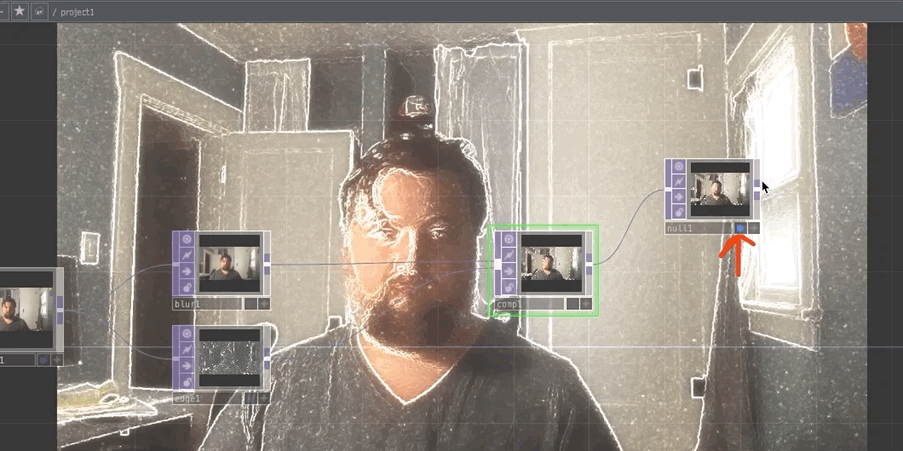
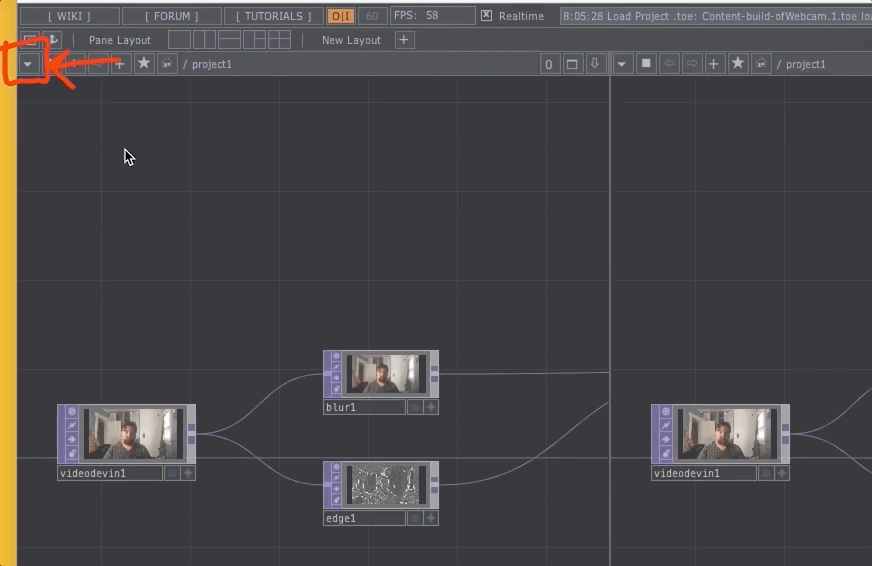

I sometimes find it difficult to work with the display preview that we have been using, where my work is shown in the background of the TouchDesigner network. It can make it difficult for me to see connection wires, or fully see my network.

Another way to work is to use a pane and show a dedicated output display next to your network.

To do this, first turn off the display by unselecting the blue dot in the `null1` operator.

## 1. Add a Second Pane

To add a second pane, select one of the pane layout options near the top-left of the TouchDesigner window.

You should see a second pane of your network either side-by-side, or on-top of each other.

## 2. Change the Pane Type

We need to change the "pane type" in order to view our work in this new pane. To do this, press the "pane type" drop down menu arrow. _This arrow is a small box, with a downward facing arrow in the top-left corner of the pane. You will notice that both panes have this same arrow in their top-left corner.

When you open the drop-down menu, select the "Panel" option. This should cause you to see a black "screen" in the pane.

## 3. Add an **_Out_** Operator to View Your Work

To view the network in this new panel pane, we need to add another operator. This operator is an **Out** operator and is used to create outputs within components or networks.

Create the **Out** operator and connect the inlet of the resulting `out1` operator to the outlet of the `null1` operator.

Once the connection is made, you should see the output of your network in the new panel pane.

You now have a view of your work that is separate from the network, which may be easier for some of you as you work. Please feel free to use either display preview methods.

If you have a second display, you can also open the panel pane viewer, drag it to your other display, and then close the pane. Freeing up valuable screen real estate.

