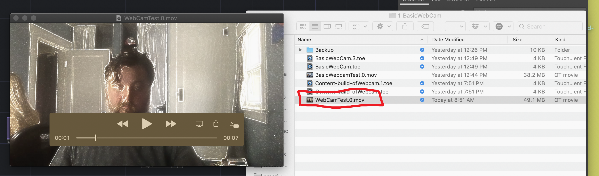

Another facility you will want is the ability to record videos from TouchDesigner. This serves a few purposes, such as sharing videos with collaborators, posting sketches to instagram to share with your adoring fans, and to create fixed-works.

To capture a recording from you TouchDesigner network we need to add another operator.

## 1. Add **_Movie File In_** Operator

Add a **Movie File Out** operator to your network. Then connect the outlet of the `null1` operator to the input of the resulting `moviefileout1` operator.

## 2. Change File Name

In the parameter window for the `moviefileout1` operator you can specify the file name with the `File` parameter. I woudl suggest you name this something that is meaningful to you.

## 3. Press Record

To record a video, toggle the `Record` parameter On/Off in the `moviefileout1` operator.

## 4. Navigate to Your Video

Your video will have been saved within your project directory. Navigate to your project directory and open your resulting movie file.

