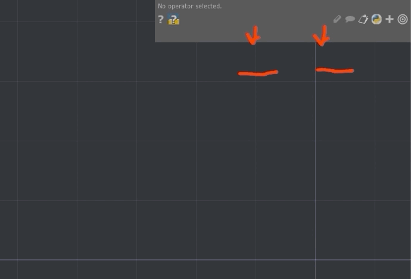
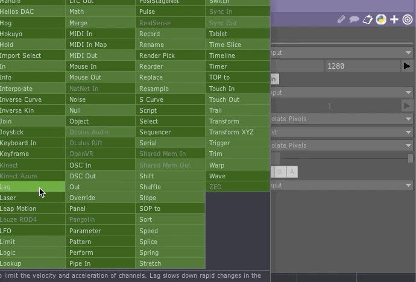
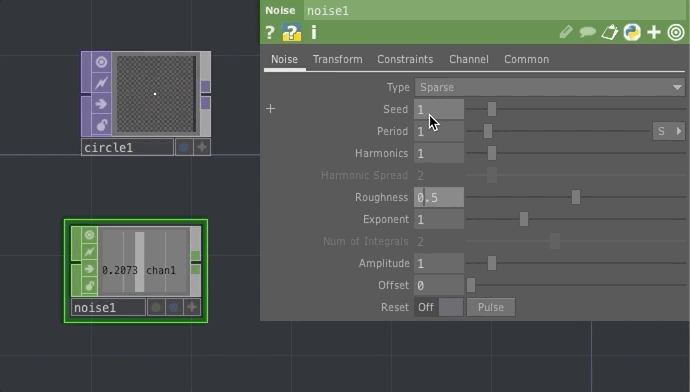
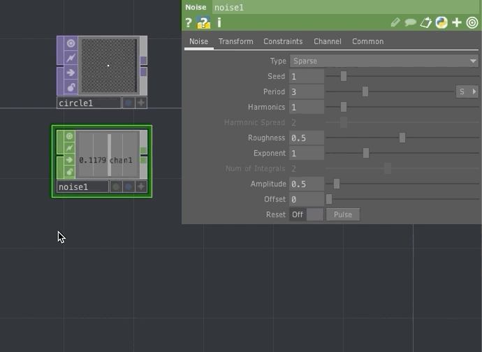
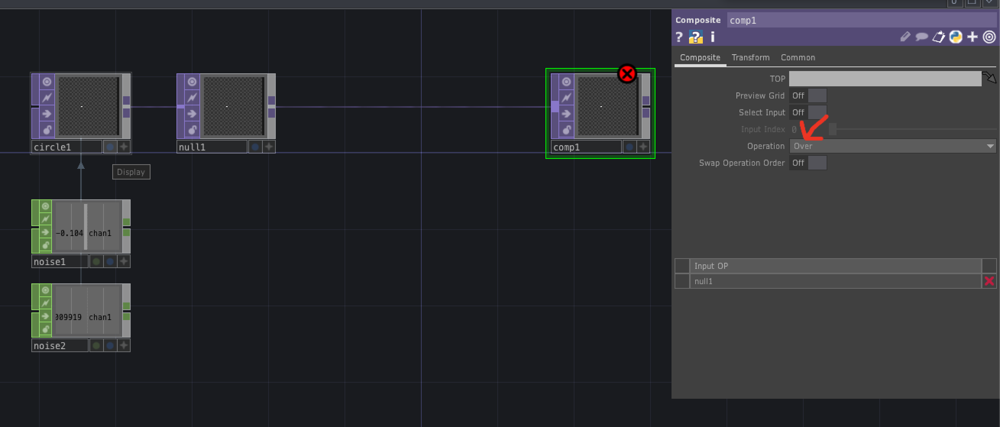
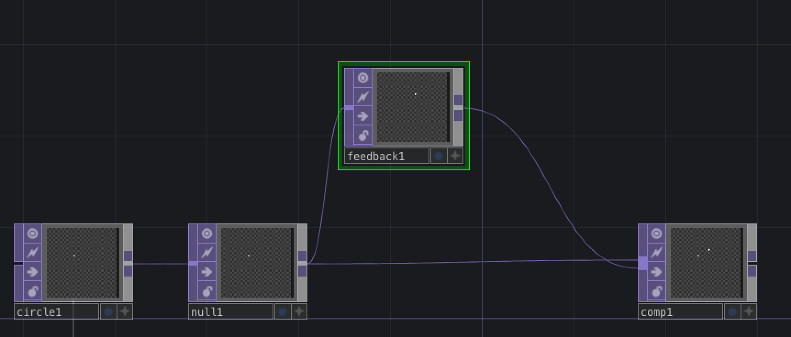
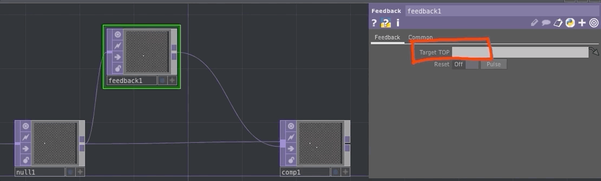
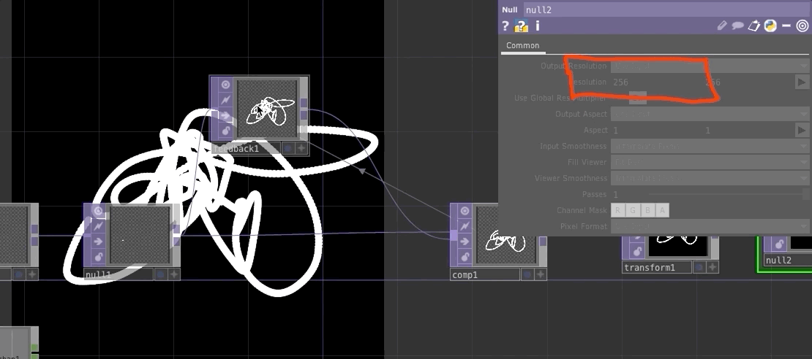

Depending on the animation environment, every "frame" is drawn by replacing the entirety of a frame with new pixels. In other words, there is typically no reference within the animation environment to any pixel information from the previous frame/s. Instead, if any data from a previous frame needs to referenced again, the animator/developer needs to create a specific reference to include that previous data in future frames.

Depending on the environment, this can be accomplished in various ways. As an example in [P5.js](p5js.org) and [Processing](processing.org) these programs build visuals by creating a canvas where everything is composited together, UNLESS the developer adds a `background()` function, which then overlays the background with a color or image of the developers choosing.

If instead the animator/developer wants to create a fading effect, where the previous frame/s are present, but fade over time. They can include an alpha value in the background function (`background( red, green, blue, alpha)`), which will cause the previous frames to "fade out" over time (dependent on the alpha value).


Include alpha example


This approach by P5 and Processing create an easy way for animators/developers to create an animation reference to previous frames. The _problem_ with this approach is that you cannot choose which elements or individual objects include a reference to previous frames, and which do not. Instead, it is a take it all or nothing approach.

In TouchDesigner, each frame is always drawn "freshly". Unlike P5 or Processing, developers/animators need to specifically create a reference to previous frames or objects if they want to generate animations with "history" or reference to these previous frames/objects.

In TouchDesigner, this is accomplished through the `Feedback` TOP.

# Feedback Tutorial Video

The following video does a really nice job of introducing this relationship between feedback and animation within TouchDesigner.

<iframe class="embed-responsive-item" src="https://www.youtube.com/embed/83K3QEK6Iv0" frameborder="0" allow="accelerometer; autoplay; encrypted-media; gyroscope; picture-in-picture" allowfullscreen></iframe>

# Work-Thru of Demo Video

The video admittedly moves quite quick for a beginner tutorial. So the following breaks down these steps a bit further.

#### 1. Add a Circle Top

- Add a circle TOP.
- Then select the "common" tab in the parameter window.
- Change the resolution to 1280px for both dimensions.
- Go back to the "Circle" tab in parameters, and change the radius to `0.01` for both dimensions.

#### 2. Add a Noice CHOP

- Add a [Noise CHOP](https://docs.derivative.ca/index.php?title=Noise_CHOP)
- Under the "common" tab in the parameter window, change "Time Slice" to `On`.
  - **{ NOTE: }** _[Time Slicing](https://docs.derivative.ca/Time_Slicing) is a feature in TouchDesigner that keeps your CHOP channels smooth, even when your overall frame rate goes down. This keeps your overall animation smoother and more accurate, and helps keep your audio from popping when your frame rate drops._

#### 3. Reduce the noise CHOP's range

- Navigate back to the "noise" tab in the parameter window of the `noise1` CHOP.
- Reduce the range of the noise chop by changing the `Period` parameter to `3` and the `Amplitude` parameter to `0.5`.

#### 4. Copy the `noise1` CHOP and alter the values

- Duplicate the `noise1` CHOP by copying and pasting.
- Then alter the `Seed` parameter value so they are "out of phase" with each other.

#### 5. Apply Noise CHOP value to Circle TOP

- Apply the values of the Noise CHOP's to the Circle TOP's
- You can accomplish this 1 of 2 ways.
  1. Drag & Drop
    - Select the "Viewer Active" switch in the desired noise CHOP.
    - Then drag the CHOP to the 'centerx' parameter value for the Circle TOP.
    - Finally select the "CHOP Reference" option.
    - This automatically creates a Python reference expression for you.
  2. Type in the Python reference for that desired CHOP channel
    - You can also directly type in the Python reference to the CHOP and channel.
    - As an example, for the 'centery' parameter value, type `op('noise2')[chan1]`
    - This tells TD to grab the `noise2` operator, and from its channel array, select `chan1`.

#### 6. Add Null and Composite TOPs

- Add a NULL TOP out of the `circle1` TOP.
- Add a Composite TOP out of the `null1` TOP.
- Set the "Operation" parameter in the `comp1` TOP to "Over"

#### 7. Add a Feedback TOP from `null1`

- Add a Feedback TOP from `null1`
- Connect the output from `feedback1` also to `comp1`

#### 8. Feed composite BACK

- Reference the output of `comp1` in the `feedback1` TOP
- To do this, either drag the `comp1` TOP onto the `feedback1` TOP
- OR, set the "Target TOP" parameter in the `feedback1` parameter window to `comp1`

#### 9. Add a Background and End Null

- Add a Transform TOP after the `comp1` TOP.
- Turn the "Comp Over Background Color" parameter `ON`
- Then adjust the `alpha` channel parameter for the background color to `1`
- Next, add a Null TOP
- Then turn on the viewer switch in the `null2` TOP.

#### 10. Reset the Feedback TOP

- To reset the `feedback1` TOP, click the "Pulse" button in the parameter window.

#### 11. Add Gradual Fade with Feedback Opacity

- To add a gradual fade out of previous frames, add a Level TOP between the `feedback1` and `comp1` TOPs.
- Then under the "Post" tab in the parameter window, lower the `Opacity` parameter value. (_notice how different values effect the emergent work_)

#### Please Keep Going

Now that you have the basic network setup, please try and play with some of the other examples demo'd in the video above.
