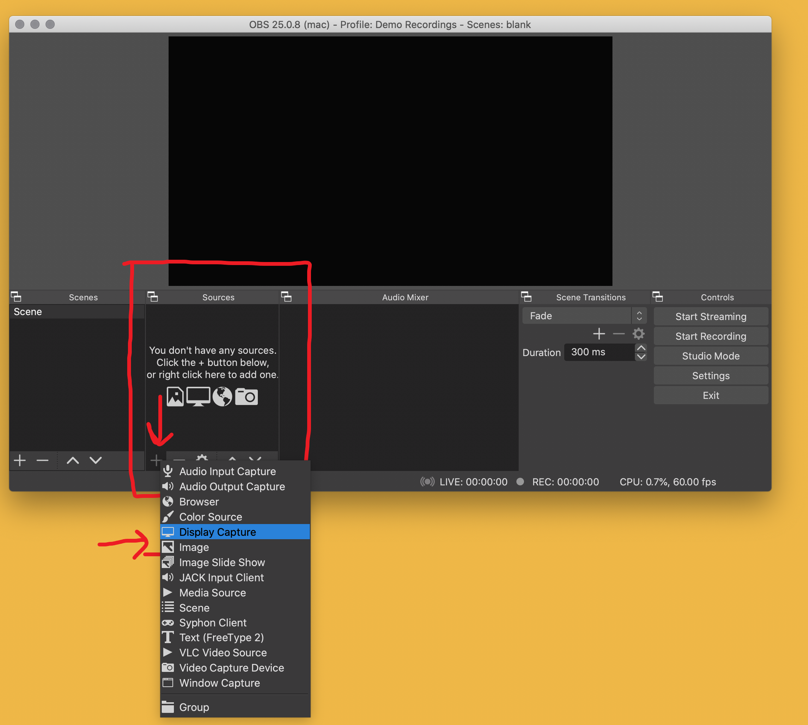
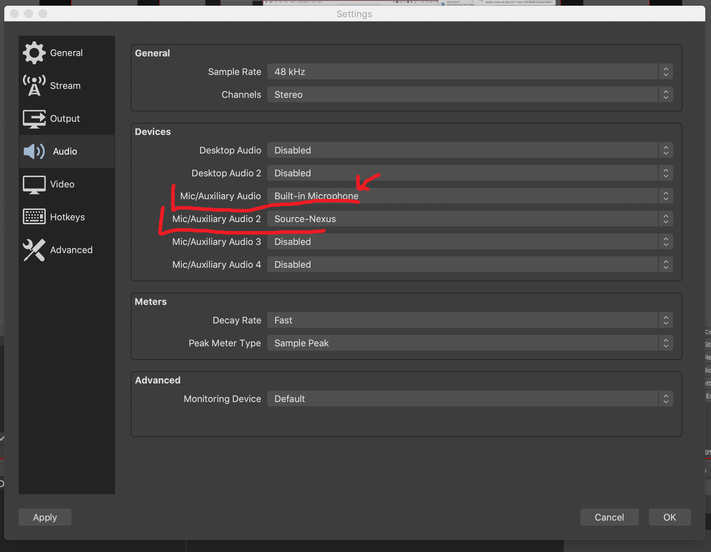
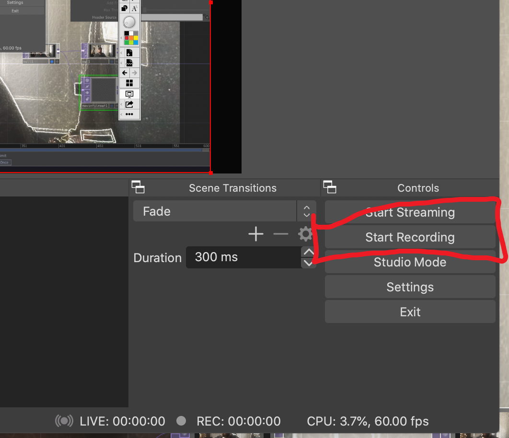
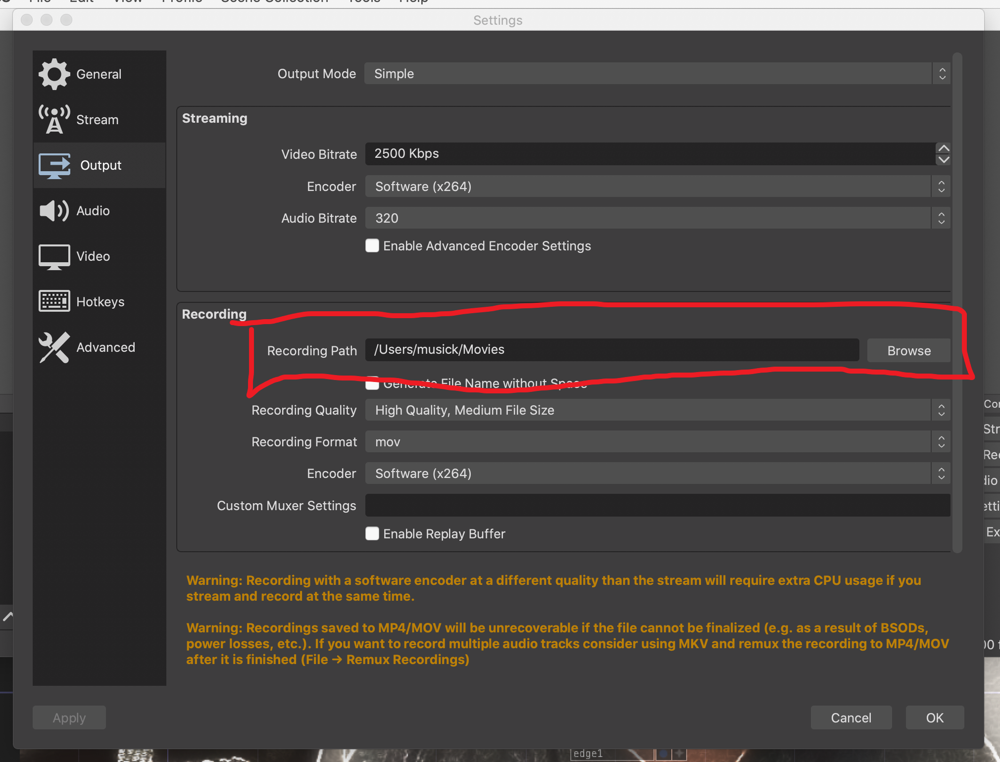

Another basic technique that will serve you this semester (and likely beyond), is the capability to capture your computers screen as a video. For this class, we will often have you capture a screen recording of your TouchDesigner networks. This will allow us to see you interacting with it, as well as offer you an opportunity to show and talk about your network.

We suggest you use the now widely popular and ubiquitous [OBS](https://obsproject.com) streaming and recording software for this purpose. OBS is by many to stream games to platforms such as Twitch, or to live stream to platforms like YouTube and Facebook. However, for our purposes, OBS also serves as a highly capable recording software. (I am in fact using OBS to make all of the lecture videos for this course.) The other advantage to OBS is that it is cross-platform and works on all three major operating systems (macOS, Windows, and Linux).

> **{ NOTE: }** If you have another program or method for recording your computers screen that you prefer, please feel free to utilize it instead. We are offering this as a solution to those of you who have not done this before.

## Install OBS

To get started, download the appropriate version of OBS from their website for your computer's operating system.

- [https://obsproject.com](https://obsproject.com)

## Setup OBS

After installing OBS, follow their "Quickstart" guide.

- [https://obsproject.com/wiki/OBS-Studio-Quickstart](https://obsproject.com/wiki/OBS-Studio-Quickstart)

In particular, when you open OBS for the first time, allow the "Auto-Configuration Wizard" to analyze and automatically setup your system for you. **{ NOTE: } Insure that you tell the "Auto-Configuration Wizard" to "Optimize just for recording."**

> For macOS users, you will need to also follow OBS's suggestions for capturing audio from your system, which includes installing one additional audio capture program.
>
> - [https://obsproject.com/forum/resources/os-x-capture-audio-with-ishowu-audio-capture.505/](https://obsproject.com/forum/resources/os-x-capture-audio-with-ishowu-audio-capture.505/)

## Create a Record Scene

Once OBS is setup and open, you will be greeted with a blank studio screen. You will need to add a record source. To do this, click the `+` button in the sources window. Then select "Display Capture".

This will bring up a new source window. You can either change the name of the source or keep the default "Display Capture" name. Then click "OK" on this window.

This will bring up a "Properties Window" where you can set the display to capture (in case you have multiple screens) and any crop. (_I suggest you just keep the defaults and press "OK" again._)

**{ NOTE: }** Depending on how OBS setup for you, you will likely have a display capture that is larger than the usable "Base Resolution". In which case, you will need to shrink the size of the display capture window to fit the base canvas.

**{ NOTE: }** If your display capture is a different ratio than you base canvas, you may also need to center the display capture window.

## Add Audio Devices

Next, before we record, you should add your audio devices. To do this, open preferences and move to the "Audio" tab. There you should enable the "Built-in Microphone" option (on mac, or equivalent on Windows), and either the "Desktop Audio" (on Windows) or "iShow U" device on mac.

You should now see a mixer section in OBS, where you can adjust record levels for your built-in Microphone as well as system audio.

## Start a Recording

To start a recording, press the "Start Recording" button in OBS. When you are finished, you can press the related "Stop Recording" button.

When you start recording, navigate such that TouchDesigner is on top. OBS will capture your screen. This way, you can show off you TouchDesigner network, and resulting output (either with the background display option, side pane panel, or as a separate window).

When you care finished, you can navigate back to OBS, to press the stop recording button. You can now open recorded file and either edit it, or share it as is (I would suggest trimming the start and end).

> **{ NOTE: }** You can check where OBS stores your recordings by opening OBS Preferences, navigating to the "Output" tab, and checking the directory path under "Recording Path".

