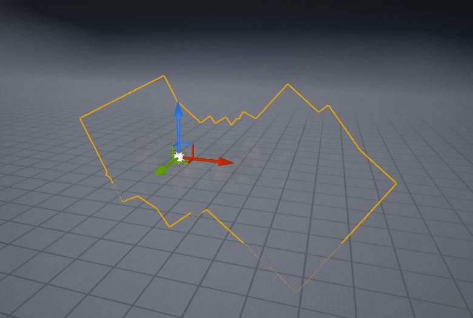
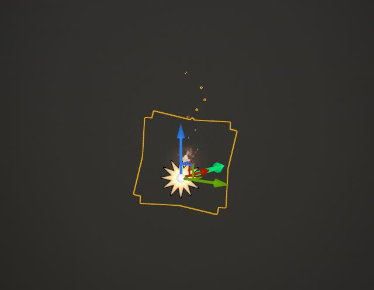
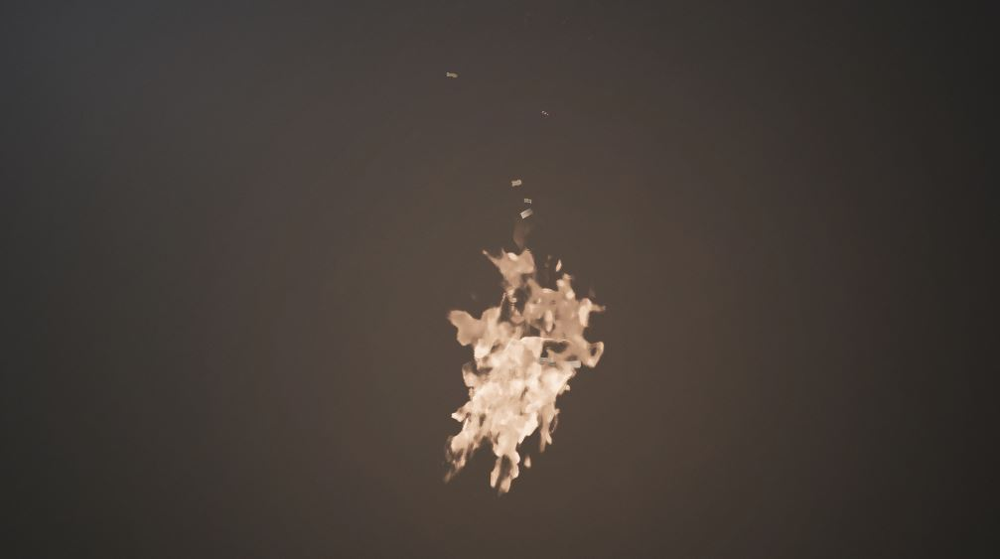

## Basics of Particles

Particles are a common technique used in computer graphics that use sprites(2D Images) or 3D models or other graphic objects.  Particles are often used to simulate moving water, fire, explosions, smoke, clouds, fog, snow, stars, and other abstract effects like magic.  These simulated replicas of natural phenomena are often systematically re-emitted from the source of an effect.  Other uses for particle effects are strands like fur, hair, and grass.

Particle systems can be implemented in numerous software.  Depending on the software particles usually come from an emitter source.  The emitter source may be an object that contains a set of parameters.  These parameters can then be adjusted to suit whatever effect the artist wants to achieve.  The most realistic for natural phenomena requires a physics generator.  This means that the software will need to have built-in physics that can be manipulated to that effect.

Particles are usually represented in systems.  This is because most particle systems in nodal based networks house a set of parameters that can be manipulated.  This is the beauty of particles.  A particle can start with a generic shape, but with the parameters, any set of particles can become a fire, smoke, dust, or any of the above mentioned natural/ethereal phenomena.

## So why are particles important?

Particles can make or break an experience.  Let's say you are designing a brightly lit room for a video game.  Naturally, when light rays hit a window sometimes dust can be seen.  Having these little seemingly unimportant elements within the environment allows for that sense of realism.

## Examples Using Unreal Engine:

### Dust Particles

**Dust Particles** -  this is using sprites represented by the jagged edges.  Sprites are usually 2D images.  Using 2D versus 3D is better for optimization in most software environments.  Something like this would be created in photoshop with alpha data (transparency) and then is repeatedly animated and emitted from the source.

 

When rendered (in engine) it is preserved as dust particles.

### Fire Particle System

Fire with overlays of particles.  Again this is using sprites.  For fire, multiple particle systems are overlaid to create this effect.

 

**Let's break it down.**

- Fire is made up of a source flame or a point of emission.
- The embers emitting upward are smaller particles with different physics.
- Fire also emits smoke.
- Lastly, it needs to emit light.

Each aspect of the flame listed would be a particle system that overlays on top of each other to create the effect of fire.

When rendered (in engine) a compilation of particles is then preserved as fire.

The beauty of game engines is that physics is built in.  Physics is important because it determines whether fire needs to float upwards or if rain needs to fall down.

These are just some examples of particles.  And particles can be created in many different ways.

<h4>References and Resources</h4>

The above content was written by Tina Mahagamage. It is provided with her permission. This content is also available from her blog:

<ol>
<li><a href="https://www.tinamdigitalart.com/post/particles">tinamdigitalart.com/post/particles</a></li>
</ol>

