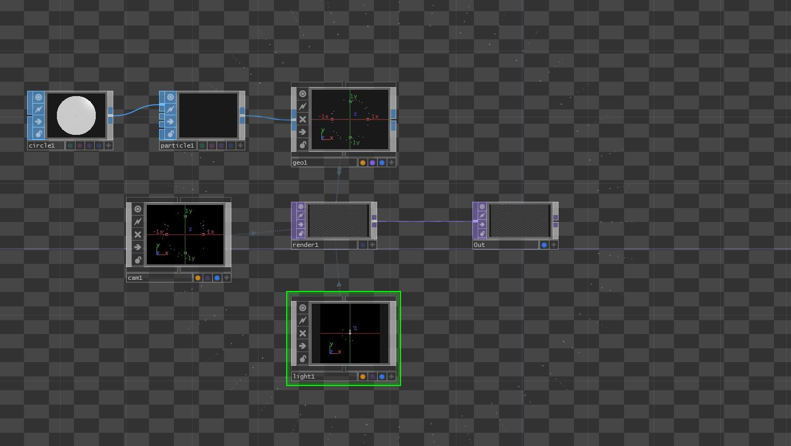
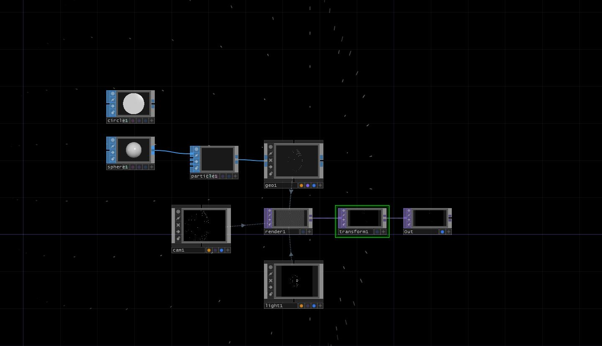
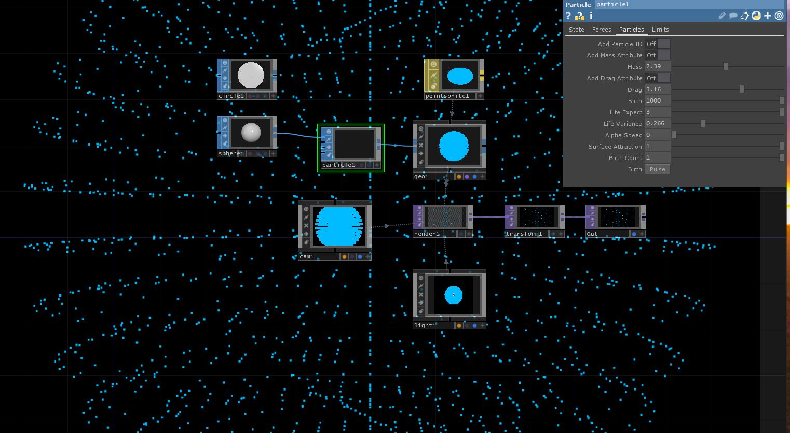
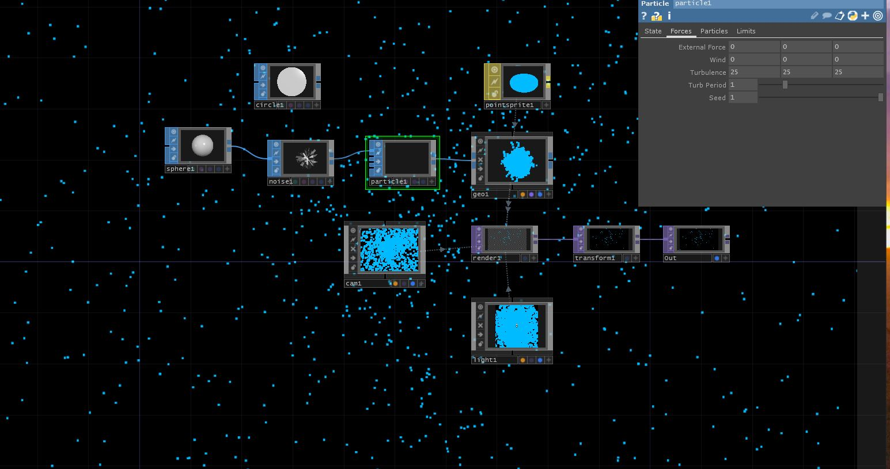

TouchDesigner doesn't have a traditional physics engine built-in like a game engine or other 3D software environments do.  TouchDesigner does offer physics through the Bullet Solver, but does not provide the same sort of range in physics.

TouchDesigner's use of particles is generally more abstract.  A lot of the work coming out of TouchDesigner is more abstract, which breaks out of constraints for realism.  Particles in TD can be driven by 3D shapes or sprites or both.

By now, you should have a basic understanding of TD nodal networks. If you feel uncomfortable with any of the following terms, please reference them (aka. go look them up) in the [Touch Designer Glossary](https://docs.derivative.ca/TouchDesigner_Glossary).

## Basic Rendered Output

Let's set up a simple render output so we can visualize it.

- Attach a `particle` SOP to `Geo` COMP.
- Set up a Camera and Light source.
- Add a `render` TOP. _This will be the source of our output._

In the example, I added a transform and gave the alpha channel a value of 1.  Then checked off comp over the background color.  This gives the effect of the black background.

- Finally, add a `null` and rename it as `Out`.  This will be your final output, which can be displayed while working.

**See Examples below.**

 

In TD, the particle system is geometry driven.  Meaning that a set of geometry nodes are needed to drive the particle generator.  However, this may not always be the case.

Let's start by adding a `circle` SOP(Surface Operator).

Now let's attach a `particle` SOP.  We can see that the particles are emitting based on Geometry.

Let's change this to a `sphere` SOP.

Now the particles are being driven by a 3D shape, not just a planar shape.

 

Let's look at the particle parameters.

There are several different options here.

_State, Forces, Particles, and Limits_

These allow you to manipulate the particles.

> Note:
> Under the State tab,
> If you change the particle type to be a point sprite a MAT will be needed. Attach MAT to the Geo node.
> This beneficial because it gives more parameters to manipulate the particles.

Change the values in these tabs to create more dynamic movement.

To create more dynamic movement you can add more SOPs to the particle, like a `noise`.

## Example File

Please feel free to download and explore the following TD network file representing the above content.

- [Basic Particle System in TD Example](https://github.com/Montana-Media-Arts/340-interactive-art/raw/master/resources-for-students/ParticleTDBasic.1.toe)

<h4>References and Resources</h4>

The above content was written by Tina Mahagamage. It is provided with her permission. This content is also available from her blog:

<ol>
<li><a href="https://www.tinamdigitalart.com/post/particles">tinamdigitalart.com/post/particles</a></li>
</ol>

