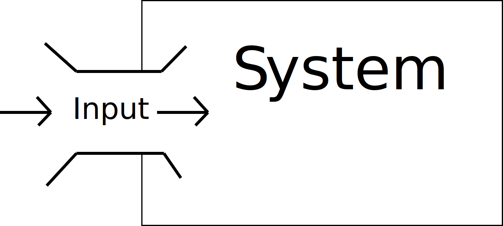

# Introducing Audio Reactive

Up to this point in the semester, you have worked on learning how TD can be used to create unique visual content, generative work, and real-time renders of 3D work. Starting this week, we begin to move towards techniques and theory of interactive systems for art.

To start this journey, we will study audio reactive systems within TD this week. We will consider an _Audio Reactive_ system to be one where _visual material responds to, plays with, and/or enhances audio or music material._

 

For this week, we are focused on reactive systems. A reactive system is one where the system alters its state or output in response to some input data.

# Audio and Visuals Together

As you can imagine, many artists and individuals have a strong connection and curiosity in how sound, audio, the sonic, or music can be enhanced, complimented, or directly tied to visual content. Throughout the 20th and 21st centuries, this has led to many artists exploring the connection between visuals that add to the experience of audio and music.

## Oskar Fischinger

An early artist who explored this connection was Oskar Fishinger, who created and produced a number of visual music-based works over the course of his life.

The most well known of these is likely his "An Optical Poem" from 1938.

<iframe class="embed-responsive-item" src="https://www.youtube.com/embed/6Xc4g00FFLk" frameborder="0" allow="accelerometer; autoplay; encrypted-media; gyroscope; picture-in-picture" allowfullscreen></iframe>

**_{ TODO: }_** Please read more about this work and Fischinger at the following:

- [Optical Poems by Oskar Fischinger, the Avant-Garde Animator Hated by Hitler, Dissed by Disney - Open Culture](https://www.openculture.com/2014/09/optical-poems-by-oskar-fischinger.html)

Fischinger was also part of the original team that began work for Disney's _Fantasia_, although he left the project due to creative differences before contributing any meaningful work to the project.

## Synesthesia

One of the curiosities with this combination is with the idea of "Synesthesia", which Psychology Today describes as:

> Synesthesia is a neurological condition in which stimulation of one sensory or cognitive pathway (for example, hearing) leads to automatic, involuntary experiences in a second sensory or cognitive pathway (such as vision). Simply put, when one sense is activated, another unrelated sense is activated at the same time. This may, for instance, take the form of hearing music and simultaneously sensing the sound as swirls or patterns of color.
>
> You can read more at: [Synesthesia - Psychology Today](https://www.psychologytoday.com/us/basics/synesthesia)

This idea has driven many to explore how sound and visuals could map onto each other or be related.

<iframe class="embed-responsive-item" src="https://www.youtube.com/embed/s32v0rTkey4" frameborder="0" allow="accelerometer; autoplay; encrypted-media; gyroscope; picture-in-picture" allowfullscreen></iframe>

<iframe class="embed-responsive-item" src="https://www.youtube.com/embed/obrBAysVef0" frameborder="0" allow="accelerometer; autoplay; encrypted-media; gyroscope; picture-in-picture" allowfullscreen></iframe>

This is rare condition. However, the idea behind seeing colors when hearing music is something that fascinates and inspires many individuals across the world to explore similar concepts. As a result, there are countless examples of artists working to create visuals that work with music.

## Liquid Light Shows (or psychedelic light shows)

For us, an important place to be aware of and recognize growth out of is the liquid light shows that came from the 60's and psychedelic.

In these shows, light artists work with oil, dye, overhead projectors, and custom light setups to create real-time visuals to accompany the music. The below video demonstrates their techniques and approach.

<iframe class="embed-responsive-item" src="https://player.vimeo.com/video/117015517" frameborder="0" allow="accelerometer; autoplay; encrypted-media; gyroscope; picture-in-picture" allowfullscreen></iframe>

# Audio Reactive Today

As you can imagine, as computers have increased in power, their ability to perform real-time based work has led to an explosion of audio-reactive content and work. Many live performances of pop, electronic, and experimental musicians are accompanied by visual material of some kind.

Some of this material is fully generative and changes drastically with each performance. Some of it is fully pre-rendered and appears to be reactive, but was conceived of in the studio. Regardless, the concepts are similar and the outcome the same; the creation of multi-media based performance work. 

<h4>References and Resources</h4>

The above content was adapted from:

<ol>
<li><a href="https://www.psychologytoday.com/us/basics/synesthesia">"Synesthesia" Psychology Today. Accessed: February 22nd, 2021. Available from; https://www.psychologytoday.com/us/basics/synesthesia.</a></li>
</ol>

