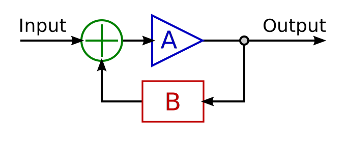

Feedback is a seemingly simple idea.

> The **Output** from some system is routed back to an **Input** for the same system. This act of feeding back information informs the future operation and state of the system.

# Examples

## Example of a Control-Based Feedback System

Feedback, as a principle, is heavily utilized in systems, for control, and as a technique in our world.

A overly simple example is the thermostat in your house. You set a desired temperature for your thermostat. The thermostat then checks the ambient temperature of your house (based on wherever it and the temperature sensor are located). If the temperature is outside of the desired range you specified (i.e. your house is too cold), then the thermostat sends a signal to your heating, ventilation, and cooling system (HVAC) to "turn on" and attempt to change the temperature in your house up or down, towards the desire temperature. The changing temperature of your house is then fed back into the temperature sensor for the thermostat and the unit assesses again the state of the house. If it is in range in turns the HVAC off, if not, it keeps adjusting the ambient temperature until it is in-range.

This type of feedback-based, real-world, control system is also known as a _cybernetic system_. A cybernetic system, is a control system that is connected with the physical world.

The use of feedback in control structures is highly common. This occurs in the physical world, as well as the digital world. There are countless digital control systems that analyze their own output to determine if a goal has been met. In Computer Science, `while`-_loops_ are often setup as feedback systems. Some condition is analyzed, if the condition is `false` then the system alters that condition in some way. The resulting condition is then reanalyzed, and the system will not continue until the analysis of the condition returns a `true` value.

<!-- Add image example of while-loop feedback system -->

## Example of an Amplification-Based Feedback System

Another example of a feedback loop you have undoubtedly experienced first-hand is that of acoustic feedback. An example of acoustic feedback often occurs at amplified concerts, where a piercing frequency is captured by a microphone, then amplified and reproduced by a speaker. This sound is then re-captured by the same microphone, and further amplified. This cycles continues until an equilibrium is reached in the system, where it is no longer possible to amplify the frequency any more OR the system is disrupted so that the signal cannot amplify itself and dies away (usually with the sound engineer frantically pulling down gain faders on a mixing board).

This feedback system amplified some piece of data or quality until a steady-state was reached, or something fundamental changed in the system (including self-destruction).

<!-- add example image -->

# Feedback System Components

Feedback can almost always be considered as part of or analyzed in relation to a _system_.

A _system_ can be thought of as a collection of elements working together towards a goal or function. These elements can be systems themselves (nested systems), actors with singular functions/tasks, or basic components of data. This allows us to account for systems of information processing, control systems, organizational systems, etc.

A _feedback system_ is a specific type of system where the output of the system informs the current and future states of the same system. I like to break down feedback systems into the following components.

## Closed and Open System

It is generally useful to consider feedback systems as either _closed_ or _open_.

In a closed system, the system does not accept outside data or energy. Generative systems, where something is created over time from nothing, can be closed systems.

In an open system, the system readily accepts outside data or energy. This data can either then be processed by the system (as in the amplification system example above) or used to test that state of the system (as in the control-system example above).


Add image examples


## Initial State

The initial state in a feedback system is defined by the value of all elements and parameters where $$time (t) = 0$$.

Initial states will often times dictate the emergent properties of a system.

## Input

A system's input allows data or something to be accepted into the system.

In the case of a control-based system this data might be analyzed into some meaningful information. However, in the case of an amplification-system or generative-system, this data may simply be passed along to the _processing_ component of the system.

## Processing

Every feedback system performs some process, or said another way they _do something_. A system's process, is what happens in response to, or directly to, the data that is passed through the system's input. This process can be a function that is performed _on_ the input data, or this process can be something that is done in _response_ to assessing the input data. These processes can both occur, or the system can only exhibit one of these behaviors.

## Output

A feedback system will have an output of data or energy. This output data is what will be fed back into the system for further processing. However, this output may also (and often is) the artifact that we are interested in. The output is the result of the system functioning.

## Effect or Input Summation

An important concept in feedback systems is the combined or summed input for the system. In the above example, the initial ambient temperature of the house is analyzed. As the thermostat alters the ambient temperature of the house with hot or cold air energy, these energies or data are summed together, and the resulting value is analyzed by the system.

Likewise, in the acoustic feedback example, the system sums together the output from itself, as well as the ambient sound currently occurring. This summed sound is captured by the input microphone.

The following graphic demonstrates constituent components of a feedback system. The system takes in an ambient input. This data is processed by the system. The processed data is then output from the processing system into the larger system or world. The same data interacts in the larger system, before being summed with the ambient input data, before being input to the processing system again.

## Feedback Coefficient

The above graphic also includes a processing system in the return path for data (the _B_ module). For some systems, particularly digital systems, there may be a _delay_ and/or _feedback coefficient_. The latter of these is a ratio or multiplier, which can effect the _amount_ of data or strength of energy before it is summed with the ambient input data.

In general, if the feedback coefficient is $1.0$ or greater, then the feedback signal is made greater than when it originally came through the input. This may result in a system that amplifies initial input data/signals. (This can also sometimes be known as a _positive feedback system_.)

Conversely, if the feedback coefficient is less than $$1.0$$, it will create a system where the initial signal _fades_ out over time. Essentially, when you multiply something by a value less than $$1.0$$, it becomes smaller and smaller every iteration, until the value is so low, it might as well be 0.

If a feedback coefficient is $$1.0$$ the signal remains the same every iteration. Likewise, if a feedback coefficient is set to $$0.0$$ then the feedback signal is reduced to nothing, thereby destroying the feedback loop.

## Delay

The mechanics of a summed input suggest that feedback systems are often time-based systems that exhibit gradual change over time. Typically, a delay naturally occurs between the initial input time and when data could be fed back again. However, sometimes, a signal or data will have additional delay added to it to alter the emergent properties and "sensitivity" of the system.
