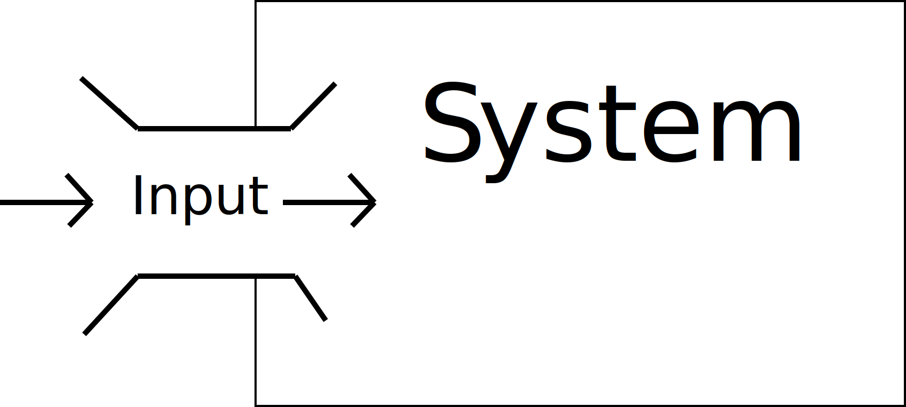

## Input Data

Regardless of whether you are working on Machine Learning applications, interactive systems, or reactive systems, there is the need to get _data_ into the system.

As you can imagine, a system that is suppose to do something, requires information to know how "to do" its thing. I.E. there has to be some sort of external information that allows the system to know what to do next.

This input data can be almost anything. It could be, from environmental data, to data about human-participants, to data from media, data from other systems. Likewise, depending on the system in question, this data can be real-time (i.e. occurring _now_) or it can be a database (i.e. stored data).

Last week, when you were working on the audio-reactive concepts, the data was real-time (i.e. was played into the system moment-by-moment) audio.

## What is the Data?

One of the tasks we have to perform as artists, system designers, or engineers is ensuring that the data that the system receives is usable, and formatted in a way that the system can do something with it.

As one example, last week, a few of the tutorials asked you to split the frequency spectrum of the incoming audio signal into three bands; low, mid, and high. You then calculated the average amplitude for each, resulting in three data streams representing momentary loudness of an audio signal across three frequency bands.

By doing this, you were taking a complex data stream, and simplifying it to single streams of numerical values that the system could understand and do something with. Although a digital audio signal is just a series of numerical values, those values are useless until we reformat them so that they are somehow meaningful.

## Features

A single measurable property that we can use as input to a system is known as a _"feature"_ (Bishop, 2006).

The process of taking complex, multi-dimensional, or non-standard data and processing it so that some property or quality can be reduced to a single value or set of values (vector) over time is known as _"feature extraction"_.

A _feature_ is the variable that helps a system know what to do, or allows it to make decisions (depending on the type and goal of the system).

A _feature_ can be any measurable data source. This could be the ambient air temperature over time, or the x/y-coordinates of a ball in space. The goal of feature selection from your perspective, is to deliver the data that will help your system best perform its task, with as few features as possible.

> ### Definition
>
> [deepai.org](https://deepai.org/machine-learning-glossary-and-terms/feature-extraction) defines "feature extraction" as follows:
>
> #### What is Feature Extraction?
>
> Feature extraction is a process of dimensionality reduction by which an initial set of raw data is reduced to more manageable groups for processing. A characteristic of these large data sets is a large number of variables that require a lot of computing resources to process. Feature extraction is the name for methods that select and /or combine variables into features, effectively reducing the amount of data that must be processed, while still accurately and completely describing the original data set.
>
> #### Why is this Useful?
>
> The process of feature extraction is useful when you need to reduce the number of resources needed for processing without losing important or relevant information. Feature extraction can also reduce the amount of redundant data for a given analysis. Also, the reduction of the data and the machine’s efforts in building variable combinations (features) facilitate the speed of learning and generalization steps in the machine learning process.
>
> #### Practical Uses of Feature Extraction
>
> Image Processing – Algorithms are used to detect features such as shapes, edges, or motion in a digital image or video.

<h4>References and Resources</h4>

<ol>
<li>Bishop, Christopher (2006). *Pattern recognition and machine learning*. Berlin: Springer.</li>
</ol>

