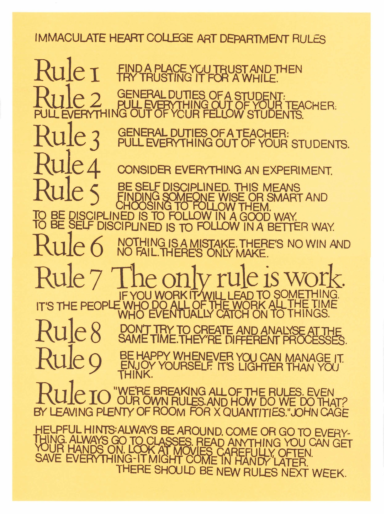
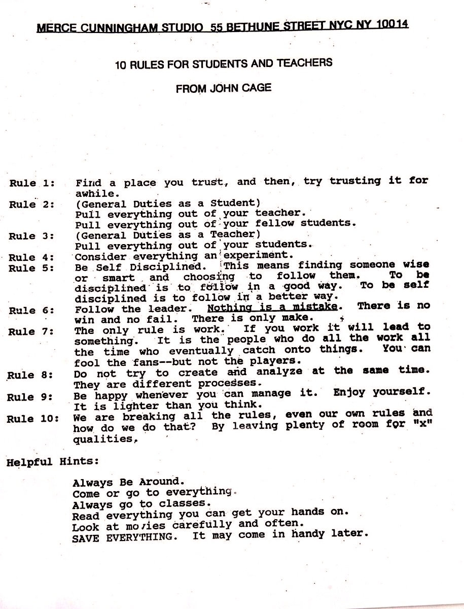

A few weeks ago you were introduced to the idea of daily sketching through the work of [Simon Alexander-Adams](https://www.simonaa.media). The major topic for this week is the idea of daily sketching.

**Daily Sketching** is the practice of spending time _every day_ creating and developing, then posting, documenting, sharing, or archiving the results in some way.

**_This is the PLAY part of art!_**

A practice of daily sketching can help you;

- develop skill and technique
- iterate through ideas and problems
- become more confident in your abilities
- create work that may be meaningful later on
- and many, many more

To get started more with this topic, I want you to watch artist Zach Liberman discuss Poetic Computation. This video also includes a discussion about his approach to daily sketching.

<iframe class="embed-responsive-item" src="https://www.youtube.com/embed/bmztlO9_Wvo" frameborder="0" allow="accelerometer; autoplay; encrypted-media; gyroscope; picture-in-picture" allowfullscreen></iframe>

This next video is a newer take on the same information.

<iframe class="embed-responsive-item" src="https://www.youtube.com/embed/mtWI6OFheVs" frameborder="0" allow="accelerometer; autoplay; encrypted-media; gyroscope; picture-in-picture" allowfullscreen></iframe>

## a.b.i.

**Always Be Iterating**

As discussed in the video above, daily sketching is not about making a new thing everyday. Instead, it is about iterating, reworking, redeveloping, and pushing. This is the magical part, that you work through ideas slowly over time.

Sure, after some amount of time you will want to change the topic, idea, or question, but find a topic or curiosity and dive in.

 

**_{ TODO: }_**

Please also read Zach's writing's on his two years of sketching.

- [Daily Sketches in 2016. - by zach lieberman | Medium](https://medium.com/@zachlieberman/daily-sketches-2016-28586d8f008e)
- [Daily sketches in 2017. - by zach lieberman | Medium](https://medium.com/@zachlieberman/daily-sketches-in-2017-1b4234b0615d)

## The ONLY Rule is work

As mentioned in the above materials, one of the things that inspired Zach was [Sister Corita Kent's](https://corita.org/about-corita) Rules for students (as made famous by John Cage).

Please read:

- [The only rule is work: Sister Corita Kent’s timeless advice for…](https://lectureinprogress.com/journal/corita-kent)

> The rules are:
>
> RULE ONE: Find a place you trust, and then try trusting it for a while.
>
> RULE TWO: General duties of a student: Pull everything out of your teacher; pull everything out of your fellow students.
>
> RULE THREE: General duties of a teacher: Pull everything out of your students.
>
> RULE FOUR: Consider everything an experiment.
>
> RULE FIVE: Be self-disciplined: this means finding someone wise or smart and choosing to follow them. To be disciplined is to follow in a good way. To be self-disciplined is to follow in a better way.
>
> RULE SIX: Nothing is a mistake. There's no win and no fail, there's only make.
>
> RULE SEVEN: The only rule is work. If you work it will lead to something. It's the people who do all of the work all of the time who eventually catch on to things.
>
> RULE EIGHT: Don’t try to create and analyze at the same time. They're different processes.
>
> RULE NINE: Be happy whenever you can manage it. Enjoy yourself. It's lighter than you think.
>
> RULE TEN: We're breaking all the rules. Even our own rules. And how do we do that? By leaving plenty of room for X quantities.
>
> HINTS: Always be around. Come or go to everything. Always go to classes. Read anything you can get your hands on. Look at movies carefully, often. Save everything. It might come in handy later.

As a note, [John Cage](https://improvisedlife.com/2018/08/01/10-enduring-rules-creative-life-sister-corita-kent-john-cage/) would appropriate the rules for his own studio and changes the last rule to "X qualities".

