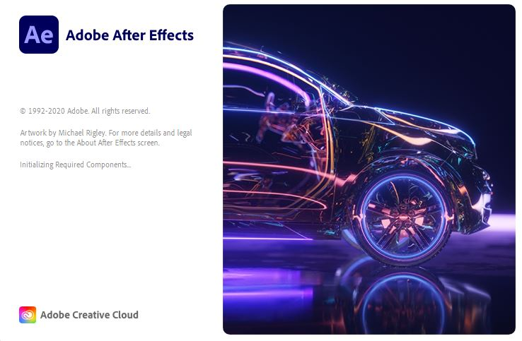
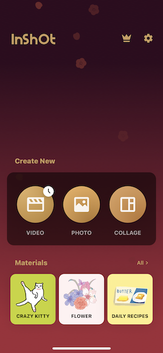
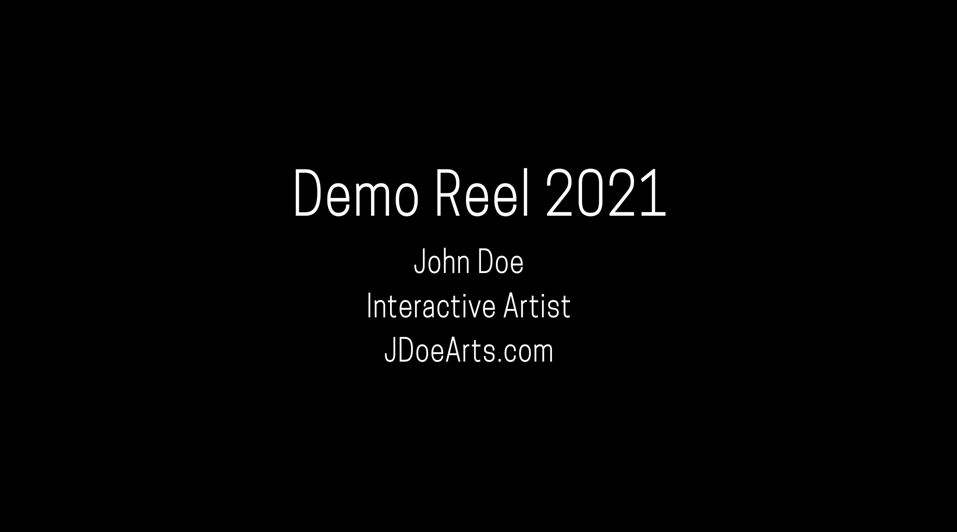
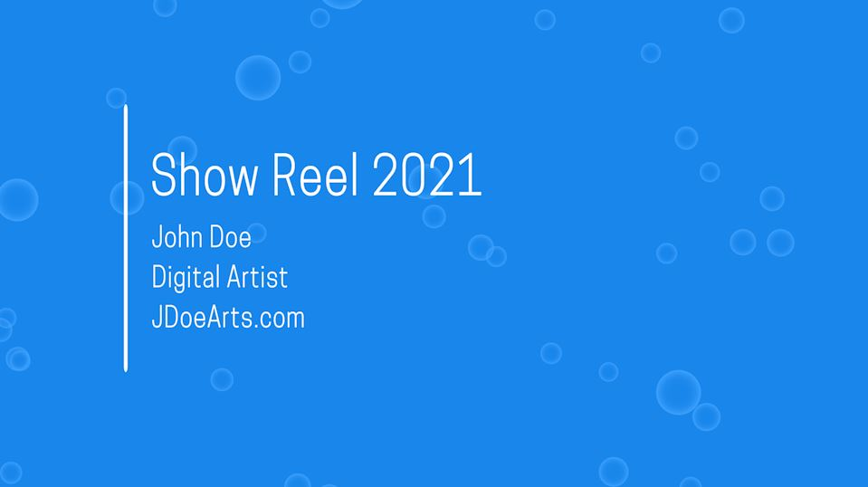
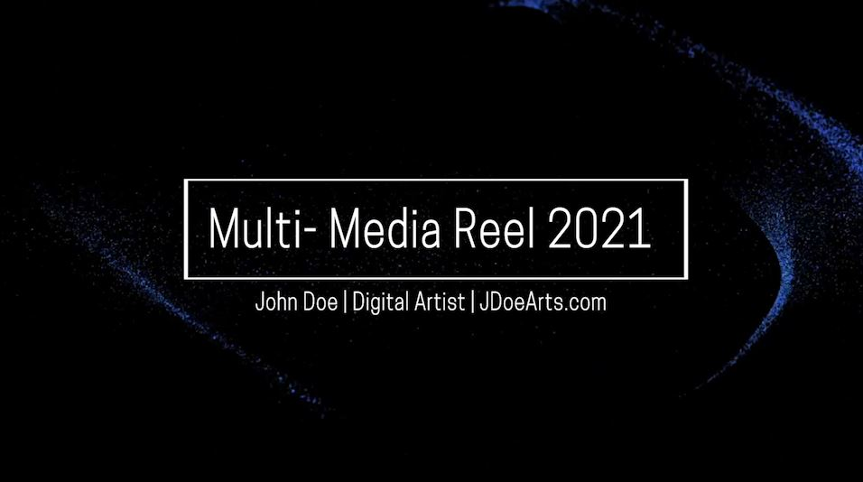
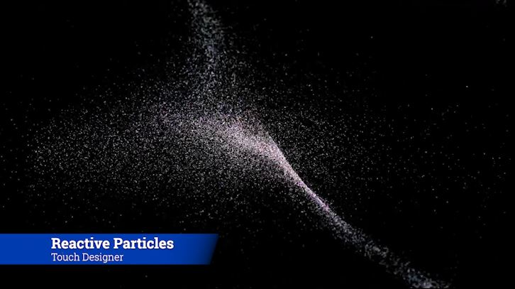
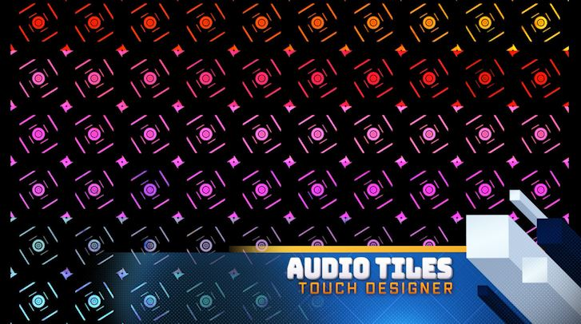

# ShowReel / Demo Reel

## What is a Demo/ Show Reel?
A reel is a video compilation of a media artist’s best works to showcase their skills and design style.

## ShowReel vs Demo Reel

These differ based on the content of the compilation.

Showreels focus on production work, software exposure done in films, tv, or the gaming industry.  Demo reels are videos of the artworks that demonstrate the technicality, skills, and abilities of the individual artists. Most digital/media arts and studios will have a demo or showreel of some sort. [2]

- **_{ TODO: }_** Please read: [DEMO REEL vs SHOW REEL - Portfolio to Stand out - by Sukesh G Tambi on Medium](https://medium.com/@sukeshgtambi/demo-reel-vs-show-reel-portfolio-to-stand-out-6710a00f17c#:~:text=SHOW%20REEL%20%3A%20%2DVideo%20showing%20the,exposure%20of%20knowledge%20to%20Recruiters)

# How to make a demo reel?

## 1. Gather your materials

- Render out or screen record each of your works. Consider a theme or a storytelling element.
- This is about you. This is highlighting your work. [3]
- **_{ TODO: }_** Please read: [5 Things That All Great Demo Reels Have - No Film School](https://nofilmschool.com/2017/05/5-things-all-great-demo-reels-have)

## 2. Use software or an app that allows for video editing

- Use any video editing software such as Adobe Premiere or After Effects etc.
- You can even use phone apps, such as InShot or Quik.

## 3. Identify your strongest works

- As a general rule, the **BEST WORK** should go first. This is your hook. The moment to captivate your viewer. End the reel with your fourth or fifth strongest piece. Finish with a bang.

## 4. Always add a title card and an end card.

- A title card introduces yourself.  Your Name, Type of Reel and year, the type of artist you are or your Role [1], and a website or contact.
- **_{ TODO: }_** Please read: [What is a Demo Reel and How to Make One? - Renderforest](https://www.renderforest.com/blog/demo-reel)
- Example:  DEMO REEL 2021, John Doe, Interactive Artist, JDoeArts.com
- You can use the title card as your end card as well.

## 5. The Lower Thirds

- When dealing with multi-media artworks, consider using the lower thirds to define the specifications for the project or the role you participated in.
- Example: `Project Name, Software used`  - or -  `Project Name, Role`
	- _Reactive Particles, Touch Designer_ - or - _Reactive Particles, Visualization Director_

## 6. Keep it Short

- A reel should be no more than 90 seconds [4]. Many reels are about 20-30
seconds. Consider this as a commercial for your artwork. [1]

## 7. Music/ Audio

- Music can be distracting. It is not necessary to add music to your reel unless it is required. For example, if there was voice acting that should be showcased. If you do add music consider the rhythm of the music and cut to the music. [1]
- Again, consider the theme or storytelling.

## 8. Rendering

- Once you have completed your reel. Be ready to render it. Consider video formats (where will this be viewed) mp4, mov, avi are notable formats. [1]

## Tip:  KEEP IT SIMPLE!

Don’t add fancy transitions or unnecessary animations.  The work should stand on its own.  Consider this a presentation of your collective work.

# Others Discuss Demo Reels

#### Video- What makes a Great Demo Reel?

<iframe class="embed-responsive-item" src="https://www.youtube.com/embed/7GIOsxUiqS0" frameborder="0" allow="accelerometer; autoplay; encrypted-media; gyroscope; picture-in-picture" allowfullscreen></iframe>

#### 10 Tips for Cutting Better ShowReels

<iframe class="embed-responsive-item" src="https://www.youtube.com/embed/Wxu1h7tpuo0" frameborder="0" allow="accelerometer; autoplay; encrypted-media; gyroscope; picture-in-picture" allowfullscreen></iframe>

# Example of Reels:

#### Touch Designer Demo Reel - Reda Radi

<iframe class="embed-responsive-item" src="https://player.vimeo.com/video/146076455" frameborder="0" allow="accelerometer; autoplay; encrypted-media; gyroscope; picture-in-picture" allowfullscreen></iframe>

## Demo Reels from Industry Professionals:

#### Laura Barbera - CG Animation Director

- [http://www.laurabarbera.com/demoreel.html](http://www.laurabarbera.com/demoreel.html)

<iframe class="embed-responsive-item" src="https://player.vimeo.com/video/167219999" frameborder="0" allow="accelerometer; autoplay; encrypted-media; gyroscope; picture-in-picture" allowfullscreen></iframe>

#### Mauro Maressa - Traditional Animation - Disney

<iframe class="embed-responsive-item" src="https://player.vimeo.com/video/19347233" frameborder="0" allow="accelerometer; autoplay; encrypted-media; gyroscope; picture-in-picture" allowfullscreen></iframe>

#### Tim Jones - Senior Game Animator + Modeler

- [https://www.artstation.com/artwork/9eOKJv](https://www.artstation.com/artwork/9eOKJv)

<iframe class="embed-responsive-item" src="https://www.youtube.com/embed/u3ZW07OAVxk" frameborder="0" allow="accelerometer; autoplay; encrypted-media; gyroscope; picture-in-picture" allowfullscreen></iframe>

#### Justin C. Harder - ClausStudios - Motion Design

- [http://www.clausstudios.com/film#/claus-montage/](http://www.clausstudios.com/film#/claus-montage/)

<iframe class="embed-responsive-item" src="https://www.youtube.com/embed/l6QuGBoLqOY" frameborder="0" allow="accelerometer; autoplay; encrypted-media; gyroscope; picture-in-picture" allowfullscreen></iframe>

## ShowReels from Studios:

#### The Third Floor

- [https://thethirdfloorinc.com/reels/](https://thethirdfloorinc.com/reels/)

<iframe class="embed-responsive-item" src="https://player.vimeo.com/video/379392180" frameborder="0" allow="accelerometer; autoplay; encrypted-media; gyroscope; picture-in-picture" allowfullscreen></iframe>

#### MPC Film

<iframe class="embed-responsive-item" src="https://www.youtube.com/embed/tf6IM7jBryM" frameborder="0" allow="accelerometer; autoplay; encrypted-media; gyroscope; picture-in-picture" allowfullscreen></iframe>

#### Framestore

<iframe class="embed-responsive-item" src="https://www.framestore.com/sites/default/files/blocks/videos/immersive_reel_nofronttitles_2.mp4" frameborder="0" allow="accelerometer; autoplay; encrypted-media; gyroscope; picture-in-picture" allowfullscreen></iframe>

- [https://www.framestore.com/work/Immersive-showreel?language=en](https://www.framestore.com/work/Immersive-showreel?language=en)

#### Brand New School

<iframe class="embed-responsive-item" src="https://player.vimeo.com/video/399932921" frameborder="0" allow="accelerometer; autoplay; encrypted-media; gyroscope; picture-in-picture" allowfullscreen></iframe>

<h4>References and Resources</h4>

The above content was adapted from:

<ol>
<li><a href="https://www.renderforest.com/blog/demo-reel">https://www.renderforest.com/blog/demo-reel</a></li>
<li><a href="https://medium.com/@sukeshgtambi/demo-reel-vs-show-reel-portfolio-to-stand-out-6710a00f17c#:~:text=SHOW%20REEL%20%3A%20%2DVideo%20showing%20the,exposure%20of%20knowledge%20to%20Recruiters.">https://medium.com/@sukeshgtambi/demo-reel-vs-show-reel-portfolio-to-stand-out-6710a00f17c#:~:text=SHOW%20REEL%20%3A%20%2DVideo%20showing%20the,exposure%20of%20knowledge%20to%20Recruiters.</a></li>
<li><a href="https://nofilmschool.com/2017/05/5-things-all-great-demo-reels-have">https://nofilmschool.com/2017/05/5-things-all-great-demo-reels-have</a></li>
<li><a href="https://michaelmusick.com/">Kolowich, Lindsay. "Web Design 101" HubSpot. October 09 2014, updated July 28 2017. Available from; https://michaelmusick.com/.</a></li>
<li><a href="https://youtu.be/R1eIozB0fFg">https://youtu.be/R1eIozB0fFg</a></li>
</ol>

<h4>Written by:</h4>

The above content was contributed by Tina Mahagamage:

<ol>
<li><a href="https://www.tinamdigitalart.com/post/how-to-reels/">How To: Reels. Available from; https://www.tinamdigitalart.com/post/how-to-reels.</a></li>
</ol>

